# PROJECT SPECIFICATION — Seasonal Sales Planning System

**Single Source of Truth for the Project (Business & Functional Specification)**

| Field | Value |
|---|---|
| Project Name | Sales Planning System (working name) |
| Document | PROJECT_SPECIFICATION.md |
| Version | 4.4 (FINAL — adds configurable Planning Input Modes: the Super Admin chooses what Sales Officers enter for Seasonal and Monthly planning (Pack Size / Total Quantity / Amount / NBV), documented in Section 38; supersedes 4.3 which added User Phone/Email and the Dealer Import workflow/audit in Section 37) |
| Status | Business & functional specification. This document is the **single source of truth**. Development may begin against it once approved; open items in Section 27 do not block the foundational phases. |
| Prepared By | Principal Architect / Business Analyst / Product Owner / UX Architect |
| Source Inputs | (1) Business Requirements Document — Seasonal Sales Planning System; (2) Excel workbook `1_Seasonal Planning_26_27_(Rahul Patidar-Hoshangabad Harda).xlsx` |
| Authority Rule | The **BRD is authoritative** for business requirements. The **Excel workbook is the real current process**. On conflict, the BRD wins and the difference is recorded under **Business Clarifications** (Section 27). |
| Guiding Principle | **Digitize the existing Excel workflow. Do not redesign the business.** |

> **Workflow refactor addendum (current UI).** Planning is organised as two workspaces —
> **Create New Plan** (editable DRAFT / RETURNED / REJECTED plans) and **View Approved Plans**
> (APPROVED, read-only) — with **Import Seasonal Plan** and **Approvals** as independent items.
> Inside Sales Planning a Create New Plan | View Approved Plans toggle drives Seasonal/Monthly/
> Yearly. The Seasonal Draft workspace tabs are **Dealer Plan · Product Plan · Dealer Summary ·
> History**.
>
> **Monthly Planning lifecycle (implemented).** Monthly Planning is now a **first-class lifecycle**:
> a **Monthly Plan** covers exactly one month of an approved seasonal plan and runs the **same
> approval workflow as Seasonal** (Officer → RM → Admin). *Create New Plan → Monthly* offers
> **Create New Monthly Plan** (choose an approved seasonal plan, then a month; **+ Add Month**
> raises a **Month Extension Request** that only takes effect when a Super Admin approves it and
> appends the month to the season). *View Approved Plans → Monthly* shows Approved monthly plans
> (read-only). From an approved seasonal plan, **Monthly Planning** opens a **Select Monthly Plan**
> dialog (Open Draft / View Approved). The Monthly screen reuses the existing planner with the
> in-page month selector removed (one plan = one month). Seasonal **Product Plan** and **Dealer
> Summary** gain a **Seasonal Total / Specific Month / Month Range** view sourced from Approved
> Monthly Plans (empty months show *"Monthly Planning has not been initiated for this month."*).
> **Dealer Completion** (Completed / No Plan / Remaining), the progress bar, and the shared
> `DealerPlanningStatus` enum are implemented. New entities: **MonthlyPlan**,
> **MonthExtensionRequest** (data lives in the existing `MonthlyEntry`; approval history in the
> existing `ApprovalAction`). See `TECHNICAL_ARCHITECTURE.md` §2a–2c for the implementation.
| Scope of this document | Business, workflow, calculations, screens, validations, permissions, functional requirements. **Not** an architecture document — technology is mentioned only where unavoidable and belongs in a future `TECHNICAL_ARCHITECTURE.md`. |

> **How to read this document.** Anything not confirmable from the BRD or workbook is flagged inline as **`⚠ Business Confirmation Required`** and consolidated in Section 27 (Business Clarifications). These are open decisions, not assumptions. Confirmed assumptions are listed in Section 26.
>
> **Version 1 workflow (confirmed).** Version 1 preserves the existing **dealer-by-dealer (dealer-first / bottom-up)** planning workflow exactly as performed in Excel. Product summaries are always **automatically calculated** from dealer planning. Product-first (top-down) planning is explicitly a **future enhancement**, not Version 1 (Sections 14, 28, 33). The exact Version 1 boundary is defined in Section 33.

> **Pricing policy override (current).** This rule supersedes every earlier statement in this
> specification about approval-time Rate/NBV% snapshots. All Planning amounts and NBV values
> always use the current Product Master (Price List) Rate and NBV%. Actual Sales Quantity and
> Actual Sales Amount are imported from the Sales file; Actual Sales Amount is the uploaded Value
> total and is never recalculated from the Price List. A repeated Dealer + Product row is summed
> for both Quantity and Value. Legacy snapshot fields may remain for compatibility but are not a
> calculation source.

---

## Table of Contents

1. Project Overview (incl. 1.1 System Scale)
2. Business Problem
3. Existing Excel Workflow
4. Excel → Web Mapping
5. Proposed Web Application
6. User Roles
7. Organization Hierarchy
8. Permission Matrix
9. Data Visibility Rules
10. Complete Business Workflow (End-to-End)
11. Complete User Journeys (Per Role)
12. Complete Data Flow
13. Master Data Modules (incl. 13.1 Master Data Ownership)
14. Seasonal Planning
15. Monthly Planning
16. Approval Workflow
17. Calculation Engine (Official Calculation Reference)
18. Validation Rules
19. Reports
20. Dashboards
21. Module Breakdown
22. Screen Specifications (incl. 22.19 Screen Wireframes)
23. Navigation Structure
24. Application Flow
25. Business Rulebook (Consolidated)
26. Assumptions
27. Business Clarifications (Confirmation Required)
28. Future Scope
29. Development Roadmap
30. Important Implementation Notes
31. Technology Note (Minimal)
32. Business Scenarios
33. Version 1 Scope (In Scope vs Future Enhancements)
34. Specification Review Summary
35. Implementation Risks & Mitigations
36. Planning Data Model (Phase 2 Architecture)
37. Dealer Import & Import History
38. Planning Configuration (Input Modes)
39. Planning Management System (Modular Planning) & Seasonal Plan Import
40. Workbook-Faithful Sales Planning (Seasonal / Monthly / Workbook View) & Tally-Ready Actuals
41. Company Onboarding (Source-Agnostic Migration Orchestration)
42. Open-Month Control (Planning-State Lifecycle)

---

## 1. Project Overview

The company sells agricultural crop-protection and crop-nutrition products (insecticides, herbicides, fungicides, botanical/bio products and plant nutrients) to farmers through a network of appointed **dealers**. Sales are planned and measured **by season** (for example Kharif and Rabi). Each **Sales Officer** is responsible for a territory and a set of dealers, and today prepares a complete seasonal sales plan for every dealer inside a single Microsoft Excel workbook.

This project replaces the Excel workbook with a **centralized, multi-user web application** that preserves the familiar quantity-based planning workflow while adding a real database, role-based access, an approval workflow, audit history, live reporting, and permanent historical accuracy.

The application is **quantity-driven**. Sales Officers enter only quantities; the system calculates every financial value — Amount, NBV, totals, achievement — from centrally-maintained master data, exactly as the Excel formulas do today. Users should feel they are using a modern version of the same planning process, not a new process.

**Primary outcomes**

- One centralized system replacing many scattered Excel files.
- Accurate, consistent calculations that always match the workbook.
- Enforced permissions and strict data isolation between Sales Officers.
- A structured approval workflow with full history.
- Live, centralized reporting and dashboards for every level of the hierarchy.
- Permanent, immutable historical records unaffected by later reassignments or price changes.

### 1.1 System Scale (Confirmed)

The system is sized for a mid-size field sales organization, not internet-scale traffic. Confirmed expected volumes:

| Entity | Expected count |
|---|---|
| Sales Officers | ~20–40 |
| Regional Managers | ~5–10 |
| Super Admins | ~1–3 |
| Dealers (total across all officers) | ~1,000–3,000 |
| Products | ~100 |
| Seasons | a few per year (e.g. Kharif, Rabi), retained indefinitely |

**Implications for the build.** These volumes are modest. A **clean monolithic web application with a single relational database is sufficient** and is the intended architecture. There is **no need** for microservices, message brokers, in-memory caches, event buses, or any distributed-systems patterns (see Section 31). The priority is correctness, clarity and maintainability for a single developer.

> **Note on the sample workbook.** The analysed workbook lists 55 products and up to 50 dealer sheets. These are properties of **one sample file**, not system limits: the 50-dealer sheet count was an Excel template artifact, and the production system supports the full scale above (thousands of dealers, ~100 products). See the resolved clarifications in Section 27 (items 9 and 10).

---

## 2. Business Problem

The Excel-based process has become unsustainable as the company grows:

- **Multiple file versions** circulate by email; nobody is sure which workbook is current.
- **Fragile formulas** — pricing is bound to spreadsheet **row position**, not product identity, so re-ordering the price list silently misprices everything (see Section 3 and Section 30).
- **Manual calculation and copy/paste** introduce errors that are hard to detect.
- **Informal approvals** (verbal or return-the-file) with no record of who approved what.
- **No audit trail** of changes.
- **No access control** — anyone with the file can see and change everything.
- **No centralized reporting**; consolidating officers or regions means merging files by hand.
- **No reliable historical tracking** across seasons.
- **Poor collaboration** — only one person can safely edit a file at a time.
- **Slow updates** across 50 dealer sheets and multiple roll-ups.
- **No live, shared visibility** of plan versus actual for managers.

**Objective:** solve all of the above while keeping the workflow familiar.

---

## 3. Existing Excel Workflow

Each Sales Officer maintains **one workbook per season**. The analysed sample workbook contains **53 worksheets** in four functional groups.

| Group | Sheet(s) | Purpose |
|---|---|---|
| Master data | `PRICELIST` | 55 products, each with technical name, **Rate**, and **% of NBV**. Centrally maintained. |
| Dealer planning (input) | 50 dealer sheets (37 active + 13 blank `Dealer 38`–`Dealer 50`) | One sheet per dealer; the Sales Officer enters quantities. |
| Season roll-up | `Product Plan` | Aggregates every dealer sheet **by product**, across the season and each month. Read-only. |
| Dealer roll-up | `Dealer Summary` | Aggregates **each dealer's** totals and achievement. Read-only. |

**Dealer sheet layout (identical for every dealer).** Rows 4–58 list the 55 products in the same order as `PRICELIST`. Manual-entry columns are:

- **Season plan quantities** — seven pack-size columns: `1/2/5 Ltr-kg`, `500 ml-kg`, `250 ml`, `100 ml`, `50 ml`, `25 ml`, `10/15 ml`.
- **Monthly plan quantity** — one `QTY` field in each of up to **six month blocks** (month names are free text; the sample names month 1 "June").
- **Monthly actual sales** — one `SALE` field in each of the six month blocks.

Everything else is formula-driven (Total Quantity, Amount, NBV, live monthly plan, pending, differences, per-month amounts, achievement). Row 59 is the **TOTAL** row; row 61 computes **ACHIEVEMENT %**.

**Data flow is one-directional:** `PRICELIST → dealer sheets → (Product Plan + Dealer Summary)`. Nothing feeds back into the dealer sheets.

**Critical discovered rule.** Dealer sheets fetch Rate and NBV% by **fixed PRICELIST row position** (product row 4 reads PRICELIST row 2, row 5 reads row 3, and so on) — *not* by a lookup on product name. Pricing is therefore bound to row alignment; inserting, deleting or re-ordering a product in `PRICELIST` without matching every dealer sheet silently shifts every calculation to the wrong product. **The web application must bind pricing to product identity, never to position** (Sections 17 and 30).

---

## 4. Excel → Web Mapping

Every worksheet and mechanism in the workbook maps to a specific web feature. The web application reorganizes the same information into permissioned, auditable, always-current screens.

| Excel worksheet / mechanism | Web equivalent | How it becomes a web feature |
|---|---|---|
| `PRICELIST` (Product Master) | **Product Management** (Master Data) | Products become records with name, technical name, Rate, NBV%, Category, Brand, Active flag. Editable only by Super Admin. Rate/NBV% flow automatically into all planning. |
| Individual **Dealer Sheet** | **Dealer Planning Screen** | Each dealer sheet becomes a per-dealer planning page listing all active products with pack-size quantity inputs and live-calculated Amount and NBV. |
| `Product Plan` (Product Summary) | **Product Planning Summary** report | The 3-D "sum across dealers by product" becomes a live, permission-filtered product summary per season and month. |
| `Dealer Summary` | **Dealer Summary Dashboard / report** | The per-dealer totals and achievement become a sortable, filterable dealer summary and feed dashboards. |
| Season structure (workbook = one season) | **Season Management + Season context** | A season becomes a first-class record with configurable months; each workbook-per-season becomes a season selected inside one system. |
| Season plan columns (pack sizes, totals) | **Seasonal Planning module** | The season-plan portion of the dealer sheet becomes the Seasonal Planning workflow (Section 14). |
| Monthly blocks (up to 6) | **Monthly Planning module** | Each month block becomes a monthly planning + actual sales entry step (Section 15). |
| Row 59 TOTAL / Row 61 ACHIEVEMENT % | **Automatic totals & achievement** | Totals and achievement are computed by the Calculation Engine (Section 17), never typed. |
| The workbook itself (one per SO/territory) | **Territory scope + data isolation** | "One workbook per officer" becomes enforced per-officer data isolation (Section 9). |
| Emailing the file for review | **Approval Workflow** | Informal review becomes Draft → Submit → RM → Super Admin → Approved with remarks and history (Section 16). |
| Manually kept prior-season files | **Historical Reports (immutable)** | Past seasons are retained permanently and never change (Sections 9, 19, 25). |

> **Note.** Nothing in the workbook is discarded. Every calculation, total and roll-up is preserved; the web application only changes *where* data is entered (structured screens) and *how* it is governed (permissions, approval, audit, history).

---

## 5. Proposed Web Application

A centralized web application that reproduces the workbook as structured, permissioned, auditable screens:

- **Per-dealer planning screen** replacing each dealer sheet — all active products with pack-size quantity inputs and live calculated Amount/NBV.
- **Product Planning Summary** and **Dealer Summary** as always-current, permission-filtered reports (replacing `Product Plan` and `Dealer Summary`).
- **Season and month configuration** owned by the Super Admin (replacing the hard-coded six-month template).
- **Approval workflow** wrapped *around* the plan (Draft → Submit → RM → Super Admin → Approved).
- **Master data modules** for products, categories, brands, dealers, users, assignments, seasons, announcements, settings.
- **Role-based dashboards** and **audit history** for every create/edit/submit/approval action.
- **Time-aware assignments** so dealer/RM reassignment changes future ownership without altering historical plans or reports.

The application must produce numbers **identical to the Excel workbook** (Section 17). Users continue to enter **only quantities**; Rate, NBV%, Amount and totals are never manually editable.

---

## 6. User Roles

| Role | Description | Primary activities |
|---|---|---|
| **Super Admin** | Owns the whole organization and all master data. | Manage products/categories/brands/dealers/users/assignments/seasons/announcements/settings; view all planning & reports; final approval. |
| **Regional Manager (RM)** | Supervises a set of Sales Officers. Optional tier. | Review/monitor assigned Sales Officers; view their reports; approve / reject / return plans. |
| **Sales Officer (SO)** | Primary planning user. | Manage assigned dealers; prepare seasonal & monthly plans; save drafts; submit; record actual sales; view own dashboard, reports, achievements, announcements. |

Master data is created and maintained **only by the Super Admin**. Sales Officers and Regional Managers are read-only consumers of master data.

---

## 7. Organization Hierarchy

The hierarchy is **flexible**, and the Regional Manager tier is **optional**.

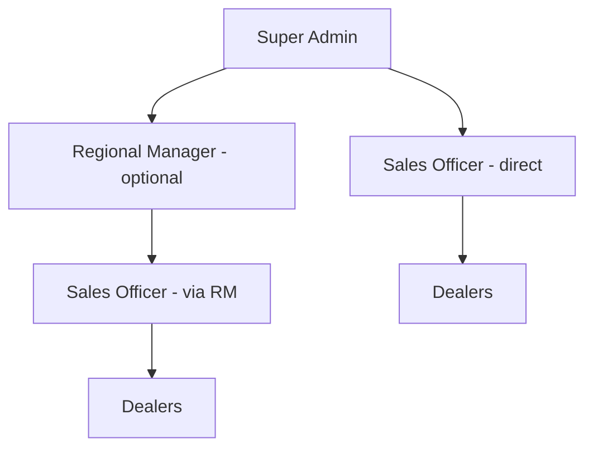

- Every **dealer** belongs to exactly **one Sales Officer** at any point in time.
- A **Sales Officer** belongs to at most one Regional Manager, or reports directly to the Super Admin.
- **Assignments change over time.** Dealer→SO and SO→RM relationships are **time-aware**: historical plans and reports stay bound to the assignment in force when they were created; only future planning follows the new assignment (Section 9).

**Worked example (historical accuracy).** Dealer A belongs to Sales Officer X during Season 2025. Later Dealer A is reassigned to Sales Officer Y. The 2025 reports still belong to Officer X. Only planning from the reassignment onward belongs to Officer Y.

---

## 8. Permission Matrix

Legend: **C** = Create, **R** = Read, **U** = Update, **A** = Approve, **—** = No access. "Own" = records within the user's own scope.

| Capability | Super Admin | Regional Manager | Sales Officer |
|---|---|---|---|
| Products / Categories / Brands / Pack Sizes | C R U | R | R (in planning only) |
| Dealers | C R U | R (assigned) | R (assigned) |
| Users | C R U | R (assigned SOs) | — |
| Dealer Assignments | C R U | R (own hierarchy) | R (own dealers) |
| RM Assignments | C R U | R (self) | — |
| Seasons | C R U | R | R |
| Announcements | C R U | R (targeted) | R (targeted) |
| System Settings | C R U | — | — |
| Seasonal Plan (own scope) | R A | R A (assigned SOs) | C R U (own) |
| Monthly Plan (own scope) | R A | R A (assigned SOs) | C R U (own) |
| Actual Sales entry | R | R (assigned) | C R U (own) |
| Reports | R (all) | R (own hierarchy) | R (own) |
| Dashboards | All | Own hierarchy | Own |
| Audit History | R (all) | ⚠ (own hierarchy — confirm) | ⚠ (own — confirm) |

> **`⚠ Business Confirmation Required`** — Whether RM/SO can view audit history for their own scope, or whether audit history is Super-Admin-only (Section 27, item 13).

---

## 9. Data Visibility Rules

Data isolation is mandatory and is the single most important control the web application adds over Excel. It must be enforced on the server for **every** query and action, never by hiding elements in the interface.

- **Sales Officer:** sees only **own** dealers, plans, reports, dashboard, achievements and targeted announcements. **Never** another Sales Officer's data.
- **Regional Manager:** sees only **assigned** Sales Officers and their dealers, plans, reports and approvals. Never unrelated regions or users.
- **Super Admin:** unrestricted access to every record.
- **Master data:** read-only to SO/RM; writable only by Super Admin.

**Historical scoping (time-aware ownership).** A report for a past season shows the ownership that existed **at that time**. Reassigning a dealer or officer today does **not** move historical records to the new owner; only future planning follows the new assignment. This applies equally to Dealer→SO and SO→RM assignments.

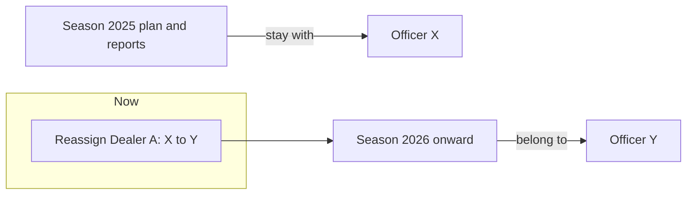

---

## 10. Complete Business Workflow (End-to-End)

1. **Setup (Super Admin):** maintain products/rates/NBV%, create the season and its months, create RMs and SOs, register dealers, assign dealers to SOs and SOs to RMs.
2. **Seasonal planning (SO):** for each assigned dealer, open the dealer planning screen and enter planned season quantities per product by pack size. The system calculates Amount and NBV and rolls up to product and territory summaries.
3. **Draft & submit (SO):** work auto-saves as Draft; when complete the SO submits for approval.
4. **Approval (RM and/or Super Admin):** the approver reviews and Approves, Rejects, or Returns with remarks. Approved plans lock from direct edit.
5. **Monthly planning (SO):** *only after the seasonal plan is approved*, the SO sets each month's target quantity per product per dealer, within the approved season plan.
6. **Actual sales capture (SO):** monthly actual sales quantities are **entered manually** by authorized users in Version 1. Version 2 will additionally allow **importing** actual sales from Excel/Tally; both manual and imported sales are the same kind of record, so the import feature adds data through the same Actual Sales concept without changing the workflow (Sections 15.5, 28).
7. **Performance tracking (all roles, by scope):** the system continuously computes remaining, achievement, gap, balance and pending target at dealer, product, territory, regional and company level.
8. **Season close & history:** at season end the plan and actuals are retained permanently and immutably as the historical record.

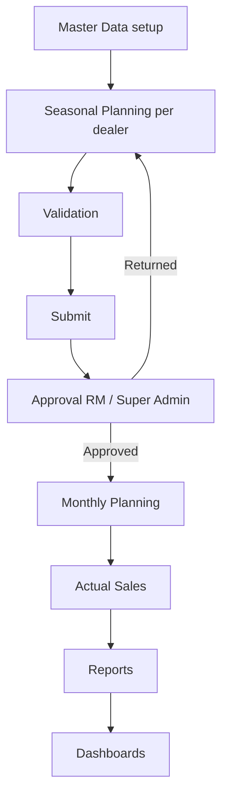

---

## 11. Complete User Journeys (Per Role)

This section describes the day-to-day experience for each role, step by step. It complements Section 10 (which is the system-level workflow) by describing what each **person** does.

### 11.1 Sales Officer — daily journey

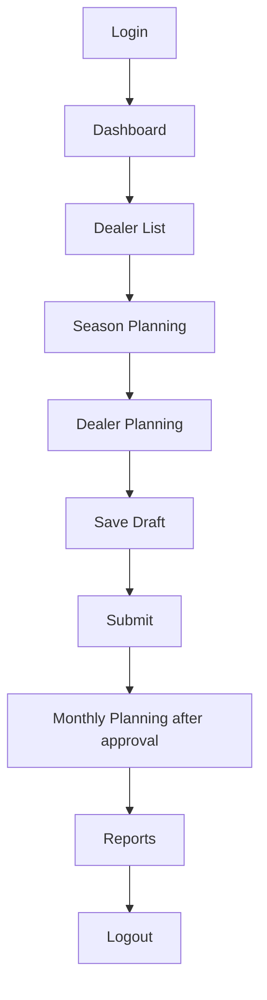

1. **Login.** The Sales Officer signs in and lands on their own dashboard. Only their data is ever loaded.
2. **Dashboard.** Shows the current open season: territory plan vs actual, achievement %, pending targets, which dealers still need planning, plan status (Draft/Submitted/Approved), and targeted announcements.
3. **Dealer List.** The officer sees **only their assigned dealers**. Each row shows planning status for the selected season (Not started / Draft / Submitted / Approved) and quick totals.
4. **Season Planning.** The officer confirms the active season (from the global season selector). Seasonal planning is where season-level quantities are captured per dealer.
5. **Dealer Planning.** Opening a dealer shows all **active** products. The officer enters **only quantities** across the configured pack sizes (rendered dynamically from the Pack Size master — Section 36). Total Quantity, Amount and NBV calculate live. Running totals for the dealer update at the bottom.
6. **Save Draft.** Work auto-saves continuously and can be saved manually. Drafts are fully editable.
7. **Submit.** When every intended dealer is planned, the officer submits. The system runs all validations (Section 18); if any fail, submission is blocked with clear messages. On success the plan is routed for approval (Section 16) and becomes read-only to the officer until returned or approved.
8. **Monthly Planning.** **Only after the seasonal plan is approved**, the officer plans month by month: entering each month's target quantity per product per dealer and, as the month progresses, actual sales. The system shows remaining seasonal quantity, monthly progress, achievement, gap and balance.
9. **Reports.** The officer views their own territory reports: product summary, dealer summary, achievement, and historical seasons (read-only).
10. **Logout.** Session ends securely.

### 11.2 Regional Manager — daily journey

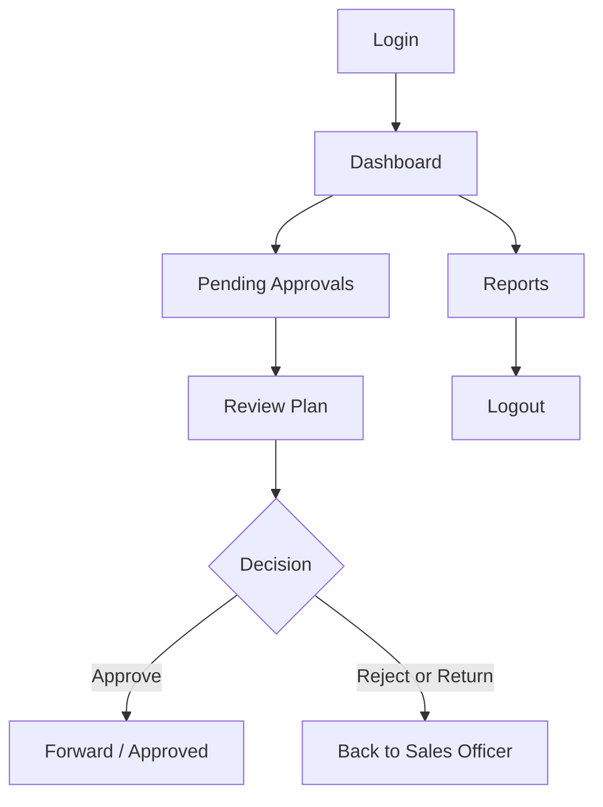

1. **Login.** The RM lands on a dashboard scoped to their assigned Sales Officers only.
2. **Dashboard.** Roll-up across assigned officers: plan vs actual, per-officer achievement, and a count of approvals awaiting action.
3. **Pending Approvals.** A queue of submitted plans from assigned officers, oldest first, with dealer/officer/season context.
4. **Review.** The RM opens a submitted plan and reviews per-dealer and per-product figures, totals and NBV. All values are read-only during review.
5. **Approve / Reject / Return with remarks.** The RM decides. Returned or rejected plans go back to the officer with mandatory remarks. Approved plans continue up the chain (to Super Admin) per the configured routing (Section 16).
6. **Reports.** The RM views consolidated regional reports across assigned officers.
7. **Logout.**

### 11.3 Super Admin — daily journey

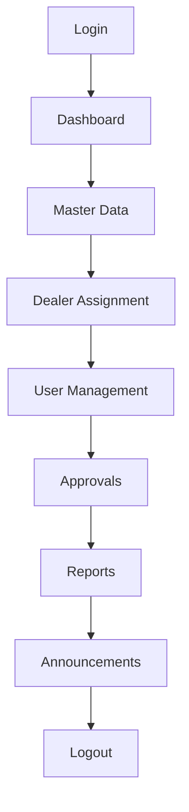

1. **Login.** The Super Admin lands on a company-wide dashboard.
2. **Dashboard.** Company plan vs actual, approvals queue, season status, master-data health, announcements.
3. **Master Data.** Maintain products, categories, brands, dealers, seasons, settings. Rate/NBV% changes here flow into future planning (never into approved history — Section 30).
4. **Dealer Assignment.** Assign or reassign dealers to Sales Officers (time-aware; history preserved).
5. **User Management.** Create/deactivate users, set roles, manage RM↔SO assignments.
6. **Approvals.** Final approval step; can review any plan in the system.
7. **Reports.** All reports at every level (company, regional, territory, dealer, product), plus historical seasons.
8. **Announcements.** Create and target announcements to roles/users.
9. **Logout.**

---

## 12. Complete Data Flow

Information moves in one primary direction, mirroring the workbook's `PRICELIST → dealer sheets → roll-ups` flow, with governance layers (validation, approval, history) added.

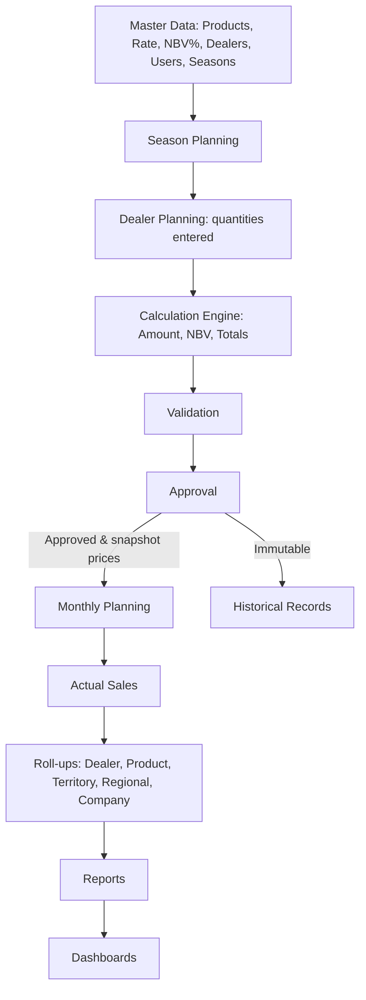

**Stage-by-stage explanation**

1. **Master Data.** Products (with Rate and NBV%), dealers, users, assignments and seasons are the inputs everything else depends on. Maintained only by the Super Admin.
2. **Season Planning.** A season provides the context (name, months, open/closed status) within which all planning happens.
3. **Dealer Planning.** The Sales Officer enters quantities per dealer per product per pack size. This is the only large-scale manual data entry in the system.
4. **Calculation Engine.** Total Quantity, Amount and NBV are computed instantly from quantities and master-data Rate/NBV% (Section 17). Nothing financial is typed.
5. **Validation.** Business rules are enforced (Section 18) before a plan can be submitted.
6. **Approval.** The plan is reviewed and approved. On approval, the Rate/NBV% used are **snapshotted** so historical figures never change if master data is later edited.
7. **Monthly Planning.** After approval, monthly targets are set within the approved season plan.
8. **Actual Sales.** Actual monthly sales quantities are recorded, enabling achievement and variance.
9. **Roll-ups.** Dealer totals aggregate into product, territory, regional and company summaries (Section 17).
10. **Reports & Dashboards.** Roll-ups feed permission-filtered reports and role dashboards.
11. **Historical Records.** Approved plans and closed seasons are retained immutably and remain accurate forever.

---

## 13. Master Data Modules

All master data is Super-Admin-owned. **Records are never permanently deleted** — they are **deactivated** and remain available for historical reports.

| Module | Key fields (from workbook + BRD) | Notes |
|---|---|---|
| **Product** | Product name, Technical name, **Rate**, **NBV %**, Category, Brand, Active flag | 55 in the sample workbook; ~100 expected in production (not a fixed limit — Sec. 1.1). Rate & NBV% are read-only to SO/RM and flow into all planning by product identity. |
| **Pack Size** | Name (e.g. 1 Kg, 500 ml), Display order, Active flag | Configurable set of pack sizes used in planning (replaces the workbook's seven fixed columns). Super Admin can add/deactivate pack sizes without code changes; the planning grid renders one column per active pack size (Section 36). |
| **Product Category** | Category name, Active flag | ⚠ Not an explicit column in the workbook — inferred from NBV% families. Mapping to confirm (Section 27, item 8). |
| **Brand** | Brand name, Active flag | ⚠ No Brand column in the workbook — mapping to confirm (Section 27, item 8). |
| **Dealer** | Dealer name, Location/town, Assigned Sales Officer, Active flag | 37 active dealers in sample; towns include Rehti, Harda, Itarsi, Vidisha. |
| **User** | Name, **Username (login identity)**, Role (Super Admin / RM / SO), **Phone (optional)**, **Email (optional)**, Active flag | Never deleted; deactivated instead. Username is the login identity; Phone/Email are optional administrative contact fields only (see note below). |
| **Dealer Assignment** | Dealer, Sales Officer, Effective period | Time-aware; preserves history (Section 9). |
| **RM Assignment** | Sales Officer, Regional Manager, Effective period | Time-aware; preserves history (Section 9). |
| **Season** | Name (e.g. Kharif 26-27), **Period (Start month+year → End month+year)**, generated **Months (ordered, 1–12)**, Seasonal/Monthly planning modes, Status (open/closed) | Admin picks a period; months are **auto-generated** from it (no free-text). Period & modes are **locked once the season holds planning data**. See Section 38.7. |
| **Announcement** | Title, Body, Target audience (role/user/⚠ region), Active period | Shown to targeted users. |
| **System Settings** | ⚠ Contents to be defined (Section 27, item 12) | e.g. approval routing defaults, season calendar. (Pack sizes are their own master — see above.) |

**Pricing history rule.** Because historical prices must remain accurate, the Rate/NBV% used by an approved plan are **captured at approval time** so later master-data edits never change past figures (Sections 17 and 30).

**Deactivation rule.** Deactivated products/dealers/users cannot be used in **new** planning but remain fully visible in historical plans and reports (Section 18).

**User identity & contact rule.** A user's **Username** is the sole login identity and the only credential used for authentication (with the password). **Phone** and **Email** are **optional administrative contact fields** — they are stored for record-keeping and reachability (for example, capturing contact details when a Sales Officer is created during a workbook import) and are **never used for sign-in, password recovery, or any authentication step**. Email is stored uniquely when provided; leaving Phone or Email blank has no effect on a user's ability to log in.

### 13.1 Master Data Ownership

All master data is **owned and managed exclusively by the Super Admin**. Regional Managers and Sales Officers **consume** master data (read-only) and can never create, edit, or deactivate it. This mirrors the Excel workbook, where the `PRICELIST` and the dealer set are controlled centrally and dealer sheets only read from them.

| Master Data | Managed By (Create / Edit / Deactivate) | Consumed By (Read-only) | Notes |
|---|---|---|---|
| **Products** | Super Admin | RM, SO (in planning) | Rate & NBV% flow into all planning by product identity. |
| **Pack Sizes** | Super Admin | RM, SO (in planning) | Configurable pack sizes; planning columns render from the active set (Sec. 36). |
| **Categories** | Super Admin | RM, SO | Classifies products (mapping ⚠ Sec. 27, item 8). |
| **Brands** | Super Admin | RM, SO | Classifies products (mapping ⚠ Sec. 27, item 8). |
| **Dealers** | Super Admin | RM (assigned), SO (assigned) | Each dealer has exactly one active Sales Officer. |
| **Users** | Super Admin | — | Roles: Super Admin / RM / SO. |
| **Dealer Assignment** | Super Admin | RM (own hierarchy), SO (own dealers) | Time-aware; preserves history (Sec. 9). |
| **RM Assignment** | Super Admin | RM (self) | Time-aware; preserves history (Sec. 9). |
| **Seasons** | Super Admin | RM, SO | Defines months and open/closed status. |
| **Announcements** | Super Admin | RM, SO (targeted) | Visibility by target audience. |
| **System Settings** | Super Admin | — | Global configuration (⚠ Sec. 27, item 12). |

**Ownership rule.** No role other than Super Admin may modify any master data (Validation V18). Sales Officers and Regional Managers only consume master data. Deactivation replaces deletion everywhere (Validation V25); deactivated records remain fully available in historical plans and reports.

---

## 14. Seasonal Planning

Seasonal planning reproduces the dealer sheet as a screen. For a selected **season** and **assigned dealer**, the Sales Officer sees all **active products** and enters the **planned season quantity** per product, split across the **configured pack sizes** from the Pack Size master (Section 36). The sample workbook used seven fixed pack sizes (`1/2/5 Ltr-kg`, `500 ml-kg`, `250 ml`, `100 ml`, `50 ml`, `25 ml`, `10/15 ml`); the web application makes this set configurable, so pack sizes can be added or deactivated without code changes and the grid renders one column per active pack size.

Per product row, the system live-calculates **Total Quantity → Amount → NBV** (Section 17). The dealer's totals roll up into the **Product Planning Summary** (per product across the officer's dealers) and the **Territory Summary** (all the officer's dealers).

**Direction of planning — Version 1 is dealer-first (bottom-up).** Version 1 preserves the existing Excel workflow exactly: the Sales Officer plans **dealer by dealer**, entering quantities on each dealer's screen. The **Product Planning Summary is always automatically calculated** as the sum of dealer quantities per product — it is a result, never an input. There is **no mandatory product-first planning** in Version 1: the officer never has to set a product target first and then split it among dealers.

**Product-first (top-down) planning is a future enhancement, not Version 1.** The alternative model — set a per-product season target, then distribute it to dealers with a "sum must equal target" validation — is deferred (Sections 28 and 33). It must never be forced onto the Version 1 workflow.

**Worked example (dealer-first, as Excel).** For product SHOOT-OUT the officer plans across three dealers: Dealer A = 300, Dealer B = 250, Dealer C = 450. The Product Planning Summary shows SHOOT-OUT season total = 1000 **automatically**, without the officer ever entering a product-level target.

The seasonal plan moves through the approval workflow (Section 16) before monthly planning can begin.

---

## 15. Monthly Planning

Monthly Planning is the second phase of the season. Where Seasonal Planning captures the whole-season quantity per product per dealer, Monthly Planning breaks that **approved** quantity down month by month and tracks it against real sales. It follows the same **dealer-first** workflow: the Sales Officer works **one dealer at a time**, exactly as in Seasonal Planning. The workbook supports up to **six months**.

**Data linkage.** Each monthly figure (`MonthlyEntry`) references the specific **approved `PlanLine`** it belongs to (by foreign key) together with the `SeasonMonth`. Because monthly planning starts only after approval, and a revision creates a new version that copies the plan lines and starts with **no** monthly entries, every monthly entry belongs cleanly to exactly one approved plan line — giving strict referential integrity (Section 36).

### 15.1 Step-by-step process

1. **Precondition — seasonal approval.** Monthly Planning is **locked until the dealer's Seasonal Plan is Approved** (Section 16). Until then the screen shows an informative message instead of entry fields (Validation V8).
2. **Open Monthly Planning for a dealer and a month.** The officer selects one assigned dealer and the current month of the active season.
3. **The system automatically displays, per product (all read-only):**
   - **Approved Seasonal Quantity** — the quantity approved in Seasonal Planning.
   - **Already Planned (previous months)** — the sum of monthly plan quantities entered in earlier months.
   - **Already Sold** — the sum of actual sales recorded so far.
   - **Remaining Seasonal Quantity** — Approved Seasonal Quantity − Already Planned (what is still available to lay into months).
   - **Remaining Amount** — Remaining Seasonal Quantity × Rate.
   - **Remaining NBV** — Remaining Amount × NBV%.
4. **The officer enters only the current month's planned quantity** per product. Nothing financial is typed; the month's Amount and NBV calculate automatically.
5. **During the month, the officer records actual sales** — the quantity actually sold for each product that month.
6. **The system continuously recalculates and displays:**
   - **Remaining Target** — how much of the season plan is still unplanned/unsold.
   - **Achievement %** — Actual ÷ Plan, on both Amount and NBV, with the zero-plan guard (Section 17.8).
   - **Pending Quantity** — planned minus sold (per month and per season).
   - **Variance** — the signed difference between actual and plan.
7. **Repeat each month** until the season closes. Each month builds on earlier months' figures, so the officer always sees the true remaining position.

> Monthly Planning **never changes the approved seasonal quantity**; it only distributes and tracks it. All figures use the formulas in Section 17 (Calculation Engine).

### 15.2 Values shown on the Monthly Planning screen

| Value | Meaning | Source |
|---|---|---|
| Approved Seasonal Quantity | Season plan quantity approved for the product | Seasonal Plan (approved) |
| Already Planned (previous months) | Sum of monthly plan quantities from earlier months | Calculation |
| Already Sold | Sum of actual sales to date | Actual sales entries |
| Remaining Seasonal Quantity | Approved − Already Planned | Calculation |
| Remaining Amount | Remaining Seasonal Quantity × Rate | Calculation |
| Remaining NBV | Remaining Amount × NBV% | Calculation |
| Total Monthly Planned Qty | Sum of all monthly plan quantities | Calculation |
| Difference / Excess | Total Monthly Planned − Approved Seasonal Qty (positive ⇒ over-planned, shown as a warning) | Calculation |
| Current Month Plan Qty | The month's target | Officer input |
| Current Month Sold Qty | Actual sales that month | Officer input |
| Achievement % (Amount & NBV) | Actual ÷ Plan (zero-plan guard) | Calculation |
| Pending Quantity | Plan − Sold | Calculation |
| Variance | Actual − Plan | Calculation |

### 15.3 Complete business example

Product **SHOOT-OUT**, Rate 614.25, NBV% 25%. Approved Seasonal Quantity for dealer "Vijasan ksk Rehti" = **100 units**. Season months: June, July, August.

**June**
- Already Planned (previous months) = 0 → Remaining Seasonal Quantity = 100.
- Remaining Amount = 100 × 614.25 = 61,425.00; Remaining NBV = 15,356.25.
- Officer plans June = **40**; actual sold in June = **30**.
- June Achievement (Amount) = (30 × 614.25) ÷ (40 × 614.25) = **75%**; June Pending Qty = 40 − 30 = **10**; June Variance = **−10**.

**July**
- Already Planned (previous months) = 40 → Remaining Seasonal Quantity = 100 − 40 = 60.
- Remaining Amount = 60 × 614.25 = 36,855.00; Remaining NBV = 9,213.75.
- Officer plans July = **35**; actual sold in July = **38**.
- July Achievement (Amount) = 38 ÷ 35 = **108.6%**; July Pending Qty = 35 − 38 = **−3** (over-sold); July Variance = **+3**.

**August**
- Already Planned (previous months) = 75 → Remaining Seasonal Quantity = 100 − 75 = 25.
- Officer plans August = **25** (completing the season plan); actual sold = **20**.
- **Season to date:** planned across months = 100 (matches the approved quantity); sold = 30 + 38 + 20 = **88**.
- **Season Achievement (Qty)** = 88 ÷ 100 = **88%**; **Remaining (unsold) Season Qty** = 100 − 88 = **12**; **Season Variance (Qty)** = 88 − 100 = **−12**.

This is exactly the month-by-month roll-forward the Excel monthly blocks perform, now calculated and displayed automatically.

### 15.4 Over-planning is allowed (management visibility, not a restriction) — CONFIRMED

The Seasonal Plan is the company's **official approved target**. Monthly Planning is an **operational distribution layer** on top of it. A Sales Officer **is allowed to plan more than the remaining seasonal quantity** when business circumstances require it (for example, over-planning future months for expected market demand).

**The system must NOT block** saving, auto-saving, submission, or approval when monthly plans exceed the seasonal target. Instead it continuously calculates and displays, per product:

- **Approved Seasonal Quantity**
- **Total Monthly Planned Quantity** (sum of all monthly plan quantities)
- **Remaining Seasonal Quantity** (Approved − Total Monthly Planned; may go negative)
- **Difference / Excess = Total Monthly Planned − Approved Seasonal Quantity** (positive = over-planned)

When Monthly Planning exceeds the approved Seasonal Plan, the system shows a **warning indicator** and **highlights the excess quantity** — in Monthly Planning, in the Dealer Summary, in the Product Summary, and in dashboards wherever relevant. This is **management visibility only**; it never prevents planning or submission.

**Worked example (over-planning, allowed).** Approved Seasonal Quantity for Product A = 100. Monthly plans: June 40, July 35, August 40 → Total Monthly Planned = 115. This is **allowed**. The system shows Remaining Seasonal Quantity = −15 and Excess = +15, flags a warning, and highlights the 15-unit over-plan across Monthly Planning, Dealer Summary, Product Summary and dashboards. Saving, submission and approval all proceed normally.

> The Seasonal Plan remains the official approved target; Monthly Planning is the operational layer. See the Difference/Excess formula in Section 17.7 and the warning surfaces in Sections 19–20.

### 15.5 Actual Sales — Version 1 (manual) and Version 2 (import) — CONFIRMED

Actual sales are captured in **two stages**, but as **one kind of record** so no rework is needed later.

**Version 1 — manual entry.** Authorized users (the assigned Sales Officer) enter actual monthly sales quantities per dealer per product. This is the only actual-sales input method in Version 1.

**Version 2 — import from Excel/Tally (future).** The system will additionally import actual sales from Excel/Tally files. The future import feature must:

- Parse Excel files.
- Match **dealer aliases** to system dealers.
- Match **product aliases** to system products.
- Validate the imported data before accepting it.
- Prevent duplicate imports.
- Store import history (what was imported, when, by whom).

**Design intent (business-level, not architecture).** Manually-entered and imported actual sales are the **same kind of record** ("Actual Sales"). The system should treat both identically so that adding import in Version 2 requires **no redesign** of planning, reports or dashboards — it simply becomes another source that writes Actual Sales. Alias matching (dealer/product) is a Version 2 concern and is out of scope for Version 1. Detailed import behaviour is listed in Section 28 (Future Scope).

---

## 16. Approval Workflow

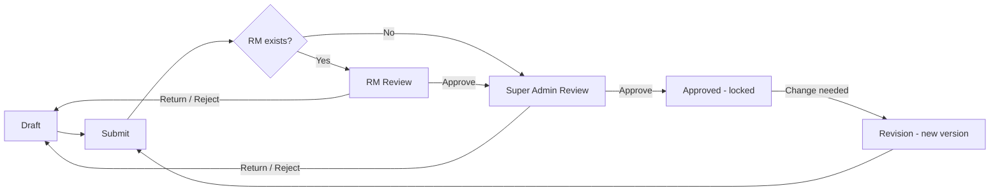

- Plans start as **Draft**, are **auto-saved**, and can be **manually saved**.
- On completion the Sales Officer **Submits**.
- Routing depends on hierarchy: `SO → RM → Super Admin`, or `SO → Super Admin` directly where no RM exists.
- An approver may **Approve**, **Reject**, or **Return with remarks** (remarks mandatory for reject/return).
- **Returned** plans become editable again by the officer.
- **Approved** plans **cannot be modified directly**. Future changes create a **revision** (new version), preserving the original immutably.
- The full history of submissions, decisions and remarks is always retained.

> **`⚠ Business Confirmation Required`** — (a) When an RM exists, is RM approval mandatory before Super Admin, or can Super Admin approve directly? (b) Can the Super Admin override/reject an RM approval? (c) Revision mechanics: who initiates a revision of an approved plan, and does a revision re-enter the full approval chain? (Section 27, items 3–4).

---

## 17. Calculation Engine (Official Calculation Reference)

This chapter is the **authoritative reference** for every calculation. It reproduces the Excel formulas exactly. All Rate and NBV% values are read from the product master **by product identity** (never by row position). No financial value is ever typed by a user.

**Symbols used**
- `Rate` = product's price per unit (from Product master, or the plan-line snapshot once approved).
- `NBV%` = product's Net Business Value percentage (from Product master), stored as a fraction (e.g. 25% = 0.25).
- **Pack-size quantities** are the per-pack quantities a Sales Officer enters for a product on a dealer. Pack sizes are **not fixed columns** — they come from the **Pack Size master** (Section 36) and are stored one row per pack in **`PlanLinePack`** (`planLineId`, `packSizeId`, `quantity`). The number of pack sizes is configurable by the Super Admin.

### 17.1 Quantity

**Total Quantity (per product, per dealer)**
```
TotalQuantity = SUM(PlanLinePack.quantity) over all of the line's PlanLinePack rows
```
*Explanation.* The per-pack quantities for a plan line are summed into a single planning quantity for the product. There are no hard-coded pack columns; the sum includes **every** `PlanLinePack` row stored on the line. The Pack Size **active** flag governs only which pack columns are offered for **new** entry — never which stored quantities are counted — so deactivating a pack size never changes an existing or approved total (immutability, Section 30). **Edge cases:** a missing pack row counts as 0; negative values are rejected (Section 18).

*Example.* SHOOT-OUT with pack quantities 10 (1 Kg), 5 (500 ml), 20 (250 ml), rest 0 → TotalQuantity = 35.

### 17.2 Rate

`Rate` is a master-data property of the product; it is never entered during planning. For **approved** plans the Rate is the **snapshot** captured at approval time, so historical figures never change (Section 30).

*Example.* SHOOT-OUT Rate = 614.25; MAXX 71 Rate = 605.15; ADAM Rate = 9253.79; ADBHUT Rate = 770.00.

### 17.3 Amount

**Plan Amount (per product, per dealer)**
```
PlanAmount = TotalQuantity × Rate
```
*Example.* 35 × 614.25 = **21,498.75**.

### 17.4 NBV (Net Business Value)

**Plan NBV (per product, per dealer)**
```
PlanNBV = PlanAmount × NBV%
```
*Explanation.* NBV is the company's net business value on a sale. NBV% is a product property clustering by family: **25%** core chemical insecticides/fungicides, **5%** herbicides, **35%** botanical/bio, **100%** nutrients/specialty kits.

*Example.* 21,498.75 × 0.25 = **5,374.69** (rounded to 2 decimals).

> **CONFIRMED (was Section 27 item 5).** NBV = **Net Business Value**. Rate and NBV% **may change** in the Product master at any time. When a Seasonal Plan is **approved**, its Rate and NBV% are **permanently snapshotted** onto that plan; later master-data changes apply to **future plans only**. All previously approved seasonal plans, monthly plans, dashboards, reports, achievement calculations and historical seasons continue to use the original snapshot values and are **never recalculated**. See Sections 13 and 30.

### 17.5 Actual Sales (per product, per dealer)

```
ActualQuantity = Sale_M1 + Sale_M2 + ... + Sale_M6     (sum of monthly SALE quantities)
ActualAmount   = ActualQuantity × Rate
ActualNBV      = ActualAmount × NBV%
```
*Example.* If monthly sales total 28 units of SHOOT-OUT → ActualAmount = 28 × 614.25 = 17,199.00; ActualNBV = 17,199.00 × 0.25 = 4,299.75.

### 17.6 Monthly (per product, per dealer, per month)

```
MonthPlanAmount = MonthPlanQty × Rate
MonthPlanNBV    = MonthPlanAmount × NBV%
MonthSaleAmount = MonthSaleQty × Rate
MonthActualNBV  = MonthSaleAmount × NBV%
MonthPendingQty = MonthPlanQty − MonthSaleQty
MonthDiffAmount = MonthPlanAmount − MonthSaleAmount
```
*Example.* June plan 10, sold 7 → MonthPendingQty = 3; MonthDiffAmount = (10×614.25) − (7×614.25) = 1,842.75.

### 17.7 Remaining, Balance, Pending (season level)

```
LiveMonthlyPlanQty  = MonthPlanQty_M1 + ... + MonthPlanQty_M6   (= Total Monthly Planned Qty)
SeasonVsMonthDiff   = LiveMonthlyPlanQty − TotalQuantity        (how much of the season plan has been laid into months)
MonthlyExcessQty    = MAX(0, LiveMonthlyPlanQty − TotalQuantity) (over-planned amount; drives the warning indicator)
RemainingSeasonQty  = TotalQuantity − LiveMonthlyPlanQty        (unplanned remainder; MAY BE NEGATIVE when over-planned)
SeasonPendingQty    = ActualQuantity − TotalQuantity           (workbook definition: actual minus season plan)
RemainingUnsoldQty  = TotalQuantity − ActualQuantity           (business view: how much of the plan is still unsold)
```
*Note.* Three distinct "remaining" ideas exist and are labelled explicitly in reports to avoid confusion: (1) **RemainingSeasonQty** = season plan minus what has been laid into months (negative ⇒ over-planned, see Section 15.4); (2) **RemainingUnsoldQty** = season plan minus actual sales; (3) the workbook's **SeasonPendingQty** = actual minus plan. **MonthlyExcessQty** is the positive over-plan that triggers the warning surfaces. Over-planning is permitted and never blocks the workflow (Section 15.4).

### 17.8 Achievement (with zero-plan guard)

```
Achievement_Amount = (PlanAmount = 0) ? 0 : ActualAmount ÷ PlanAmount
Achievement_NBV    = (PlanNBV    = 0) ? 0 : ActualNBV    ÷ PlanNBV
```
*Explanation.* Achievement is always expressed **two ways** — on Amount and on NBV — and returns **0** when the plan is 0 (division-by-zero guard from the workbook). Displayed as a percentage.

*Example.* ActualAmount 17,199.00 ÷ PlanAmount 21,498.75 = 0.80 → **80%**.

### 17.9 Variance

```
Variance_Qty    = ActualQuantity − TotalQuantity
Variance_Amount = ActualAmount   − PlanAmount
```
*Explanation.* Variance is the signed difference (negative = under plan, positive = over plan). "Gap" in dashboards is the shortfall `max(0, PlanAmount − ActualAmount)`.

### 17.10 Roll-up totals

```
DealerTotal_X      = Σ over all products of X for that dealer        (X ∈ {Qty, Amount, NBV, Actual*, ...})
ProductSummary_X   = Σ over the officer's dealers of dealer X         (per product; bottom-up, as Excel)
TerritorySummary_X = Σ over all the officer's dealers of dealer X
RegionSummary_X    = Σ over the RM's Sales Officers of territory X
CompanySummary_X   = Σ over all regions of X
```
*Explanation.* Roll-ups are pure sums of the leaf (dealer-product) values. Because every level is a sum of the same underlying figures, totals are always internally consistent.

### 17.11 Monthly Progress & Season Progress

```
MonthlyProgress_%  = (MonthPlanQty = 0) ? 0 : (MonthSaleQty ÷ MonthPlanQty)
SeasonProgress_%   = (TotalQuantity = 0) ? 0 : (ActualQuantity ÷ TotalQuantity)
```
*Explanation.* Monthly progress measures how much of a month's target was sold; season progress measures how much of the season plan has been sold to date.

### 17.12 Rounding rules

- **Quantities:** whole numbers (no decimals) unless the business confirms fractional packs.
- **Amount and NBV:** rounded to **2 decimal places** for display; full precision retained internally for totals to avoid cumulative rounding drift.
- **Percentages (achievement/progress):** displayed to **0–1 decimal place**; stored as fractions.

> **`⚠ Business Confirmation Required`** — Confirm decimal precision and rounding policy for quantities, Amount/NBV, and percentages (Section 27, item 7).

### 17.13 Worked full example (single product, single dealer)

| Step | Value |
|---|---|
| Pack quantities (per PlanLinePack) | 10 (1 Kg), 5 (500 ml), 20 (250 ml), rest 0 |
| TotalQuantity | 35 |
| Rate (SHOOT-OUT) | 614.25 |
| PlanAmount | 35 × 614.25 = 21,498.75 |
| NBV% | 25% |
| PlanNBV | 21,498.75 × 0.25 = 5,374.69 |
| Actual sold (season) | 28 |
| ActualAmount | 28 × 614.25 = 17,199.00 |
| ActualNBV | 17,199.00 × 0.25 = 4,299.75 |
| Achievement (Amount) | 17,199.00 ÷ 21,498.75 = 80% |
| RemainingSeasonQty | 35 − 28 = 7 |
| Variance (Qty) | 28 − 35 = −7 |

---

## 18. Validation Rules

All validations are enforced **server-side** and surfaced clearly in the interface. A plan **cannot be submitted** while any blocking validation fails.

### 18.1 Data entry validations (blocking)

| # | Rule | Applies to |
|---|---|---|
| V1 | Quantities must be **≥ 0**; negative quantities are rejected. | All quantity inputs |
| V2 | Quantities must be numeric; blank = 0. | All quantity inputs |
| V3 | **Inactive products** cannot be planned (not shown as new plan lines; retained read-only in history). | Seasonal/Monthly planning |
| V4 | **Inactive dealers** cannot be planned. | Seasonal/Monthly planning |
| V5 | The selected **season must be Open** to create or edit plans. | Seasonal/Monthly planning |
| V6 | Rate, NBV%, Amount, NBV and totals are **read-only** and never accepted from the client. | Planning |
| V7 | Monthly planning **may exceed** the approved seasonal quantity — over-planning is **allowed** and must **never block** save/submit/approve. The system computes the excess and shows a **warning indicator** only (CONFIRMED — Section 15.4). | Monthly planning |
| V8 | Monthly planning is **blocked until the seasonal plan is approved**. | Monthly planning |
| V9 | A quantity may fall outside allowed decimals only if fractional packs are confirmed (Section 17.12). | Planning |

### 18.2 Workflow validations (blocking)

| # | Rule |
|---|---|
| V10 | A plan can only be **submitted** if it passes all data-entry validations. |
| V11 | **Draft** plans are editable by the owning Sales Officer only. |
| V12 | **Submitted** plans are read-only to the Sales Officer until returned or approved. |
| V13 | **Approved** plans are **read-only** to everyone; changes require a **revision** (Section 16). |
| V14 | **Reject / Return** requires **remarks**. |
| V15 | Only the correct approver in the routing chain can act on a plan (Section 16). |

### 18.3 Access & isolation validations (blocking, security-critical)

| # | Rule |
|---|---|
| V16 | A Sales Officer **cannot access another officer's** dealers, plans, reports or dashboard — enforced on every request. |
| V17 | A Regional Manager can only access **assigned** Sales Officers and their data. |
| V18 | Master data write operations are permitted **only** for the Super Admin. |
| V19 | Historical records cannot be modified by anyone (immutability). |
| V20 | Reassignment does not alter historical ownership (time-aware scoping). |

### 18.4 Master-data validations

| # | Rule |
|---|---|
| V21 | Product Rate and NBV% must be present and non-negative. |
| V22 | A dealer must have exactly **one** active Sales Officer assignment at any time. |
| V23 | A Sales Officer has at most one active RM assignment (or none = direct to Super Admin). |
| V24 | A season must define between **one and six** ordered, named months (six confirmed as the maximum — Sec. 27 item 9). Month order must be unique and sequential. |
| V25 | Deactivating a product/dealer/user must not delete history; it only prevents new usage. |

### 18.5 Additional business validations

| # | Rule | Rationale |
|---|---|---|
| V26 | Names must be **unique within their scope**: product name, category name, brand name, season name (per year), and user identity are each unique. | Prevents ambiguous master data. |
| V27 | A dealer **cannot be assigned to an inactive Sales Officer**; a Sales Officer cannot be assigned to an inactive Regional Manager. | Keeps the live hierarchy valid. |
| V28 | Actual monthly sales can only be entered for a month **that belongs to the season and is not in the future** relative to the current date. | Prevents recording sales for months that have not occurred. |
| V29 | A season **cannot be closed while approvals are still pending** for that season (⚠ confirm: block vs warn — relates to Sec. 27). | Avoids freezing plans mid-approval. |
| V30 | Monthly sale quantity and monthly plan quantity must each be **≥ 0** and numeric (blank = 0), same as seasonal quantities (V1, V2). | Consistent quantity handling everywhere. |
| V31 | A Sales Officer can only **submit** a plan for a dealer that is **currently assigned to them** in the active season. | Reinforces data isolation at submission. |
| V32 | Reactivating a previously deactivated product/dealer does **not** retroactively add it to already-approved plans; it only becomes available for **new** planning. | Protects historical immutability. |

---

## 19. Reports

All reports are **permission-filtered by scope** (Section 9), reproduce the workbook's roll-ups, and add higher-level aggregations. Every measure is shown on **Quantity**, **Amount** and **NBV** where applicable, with the **zero-plan guard** on percentages (Section 17.8). All reports are read-only.

**Common capabilities (all reports)**
- **Filters:** season (default = current open season), and — where in scope — region, officer, dealer, category, brand, product, month, plan status.
- **Sorting:** any column ascending/descending.
- **Search:** by dealer/product/officer name.
- **Grouping:** by category/brand/officer/region where meaningful.
- **Totals:** column totals and a grand total row (matching the workbook TOTAL row).
- **Export:** to spreadsheet/PDF (⚠ formats to confirm, Section 27 item 15 relates).
- **Drill-down:** click a summary row to see its components (company → region → officer → dealer → product).

### 19.1 Report catalogue

| Report | Purpose | Key columns | Grouping / drill-down | Role visibility |
|---|---|---|---|---|
| **Product Planning Summary** | Season & monthly plan vs actual per product (replaces `Product Plan`). | Product, Category, Brand, Plan Qty, Plan Amount, Plan NBV, Actual Qty, Actual Amount, Actual NBV, Pending, Variance, Achievement % (per month + season) | Group by category/brand; drill to dealers contributing to a product | SO (own), RM (region), Super Admin (all) |
| **Dealer Summary** | Per-dealer plan, actuals and achievement (replaces `Dealer Summary`). | Dealer, Sales Plan, Plan NBV, Live Month Plan, Month NBV, Actual Sales, Actual NBV, Sales Achieve %, NBV Achieve % | Drill to that dealer's product lines | SO (own), RM (region), Super Admin (all) |
| **Territory Summary** | Officer's total position across dealers. | Officer, total Plan/Actual Amount & NBV, achievement % | Drill to dealers | SO (self), RM (assigned), Super Admin |
| **Regional Summary** | RM roll-up across officers. | Region/RM, per-officer totals, achievement % | Drill officer → dealer → product | RM (own), Super Admin |
| **Company Summary** | Whole-company position. | Region totals, company totals, achievement % | Drill region → officer → dealer → product | Super Admin |
| **Achievement Report** | Focused plan-vs-actual performance. | Entity, Plan, Actual, Achievement % (Amount & NBV), Gap | Any level | By scope |
| **Monthly Progress Report** | Month-by-month plan vs actual. | Month, Plan Qty/Amount, Sale Qty/Amount, Progress %, Pending | By dealer/product | By scope |
| **Historical Reports** | Any past (closed) season, immutable. | Same as above, frozen | By season | By scope (time-aware ownership) |
| **Audit / Activity Report** | Who did what and when. | Timestamp, user, role, action, entity, before/after summary | By entity | Super Admin (⚠ RM/SO own scope — confirm) |

### 19.2 Detailed report specifications

Each report below is specified with **Purpose · Who can access · Columns · Filters · Sorting · Drill Down · Export · Business Use.** All reports are read-only, permission-scoped (Section 9), and use the zero-plan guard on percentages (Section 17.8).

**Product Planning Summary** (replaces `Product Plan`)
- **Purpose:** show season and monthly plan vs actual for every product.
- **Who can access:** SO (own territory), RM (assigned officers), Super Admin (all).
- **Columns:** Product, Category, Brand, Plan Qty, Plan Amount, Plan NBV, Actual Qty, Actual Amount, Actual NBV, Pending Qty, Variance, Achievement % (Amount & NBV), **Total Monthly Planned, Excess (over-plan — highlighted when > 0)**, per-month breakdown.
- **Filters:** season, month, category, brand, product, (RM/Admin: officer/region).
- **Sorting:** any column; default by Plan Amount descending.
- **Drill Down:** click a product to see contributing dealers.
- **Export:** spreadsheet/PDF.
- **Business Use:** identify which products are driving or missing the plan across the territory.

**Dealer Summary** (replaces `Dealer Summary`)
- **Purpose:** per-dealer plan, actuals and achievement.
- **Who can access:** SO (own), RM (assigned), Super Admin (all).
- **Columns:** Dealer, Sales Plan, Plan NBV, Live Month Plan, Month NBV, Actual Sales, Actual NBV, Sales Achieve %, NBV Achieve %, **Excess (over-plan — highlighted when > 0)**.
- **Filters:** season, dealer, town, (RM/Admin: officer).
- **Sorting:** any column; default by Achievement ascending (worst first).
- **Drill Down:** click a dealer to see its product lines.
- **Export:** spreadsheet/PDF.
- **Business Use:** spot underperforming dealers and follow up.

**Territory Summary**
- **Purpose:** a Sales Officer's total position across all their dealers.
- **Who can access:** SO (self), RM (assigned), Super Admin.
- **Columns:** Officer, Plan Amount, Plan NBV, Actual Amount, Actual NBV, Achievement % (Amount & NBV).
- **Filters:** season.
- **Sorting:** any column.
- **Drill Down:** officer → dealers → products.
- **Export:** spreadsheet/PDF.
- **Business Use:** the officer's headline performance for the season.

**Regional Summary**
- **Purpose:** an RM's roll-up across assigned officers.
- **Who can access:** RM (own region), Super Admin.
- **Columns:** Region/RM, per-officer Plan/Actual (Amount & NBV), Achievement %.
- **Filters:** season, officer.
- **Sorting:** any column; default by Achievement ascending.
- **Drill Down:** officer → dealer → product.
- **Export:** spreadsheet/PDF.
- **Business Use:** compare officers within a region and target coaching.

**Company Summary**
- **Purpose:** whole-company position.
- **Who can access:** Super Admin.
- **Columns:** Region totals, Company totals, Achievement % (Amount & NBV).
- **Filters:** season, region.
- **Sorting:** any column.
- **Drill Down:** region → officer → dealer → product.
- **Export:** spreadsheet/PDF.
- **Business Use:** executive view of company-wide plan vs actual.

**Achievement Report**
- **Purpose:** focused plan-vs-actual performance at any level.
- **Who can access:** by scope (SO/RM/Super Admin).
- **Columns:** Entity, Plan, Actual, Achievement % (Amount & NBV), Gap.
- **Filters:** season, level (dealer/territory/region/company), month.
- **Sorting:** any column; default by Achievement ascending.
- **Drill Down:** to the next level down.
- **Export:** spreadsheet/PDF.
- **Business Use:** quickly find who/what is behind target.

**Monthly Progress Report**
- **Purpose:** month-by-month plan vs actual.
- **Who can access:** by scope.
- **Columns:** Month, Plan Qty, Plan Amount, Sale Qty, Sale Amount, Progress %, Pending Qty.
- **Filters:** season, month, dealer, product.
- **Sorting:** by month (default), or any column.
- **Drill Down:** month → dealer → product.
- **Export:** spreadsheet/PDF.
- **Business Use:** track pace of sales through the season and catch slippage early.

**Historical Reports**
- **Purpose:** any past (closed) season, frozen and immutable.
- **Who can access:** by scope, using **time-aware ownership** (the structure that existed then).
- **Columns:** same as the live reports, snapshotted.
- **Filters:** season (past), plus the filters of the chosen report.
- **Sorting:** any column.
- **Drill Down:** as per the underlying report.
- **Export:** spreadsheet/PDF.
- **Business Use:** year-on-year comparison and audit; figures never change.

**Audit / Activity Report**
- **Purpose:** immutable record of who did what and when.
- **Who can access:** Super Admin (all); ⚠ RM/SO own scope to confirm (Section 27, item 13).
- **Columns:** Timestamp, User, Role, Action, Entity, Summary of change.
- **Filters:** user, entity type, action, date range.
- **Sorting:** by timestamp (default), or any column.
- **Drill Down:** open the affected record.
- **Export:** spreadsheet/PDF.
- **Business Use:** accountability and investigation of changes.

---

## 20. Dashboards

Dashboards are role-scoped landing pages summarizing the **current open season** by default (with a season selector). They combine summary cards, simple charts, tables, pending tasks, recent activity and announcements.

### 20.1 Sales Officer dashboard

- **Summary cards:** Season Plan (Amount & NBV), Actual Sales, Achievement %, Pending Target, # dealers planned / not planned.
- **Charts:** plan vs actual by month; achievement by dealer.
- **Tables:** dealers needing attention (no plan / draft / returned), top and bottom performing dealers.
- **Pending tasks:** returned plans to fix, months awaiting actual-sales entry.
- **Recent activity:** own recent saves, submissions, approvals/returns.
- **Announcements:** targeted announcements.
- **Progress indicators:** season progress %, per-month progress.
- **Over-plan alerts:** dealers/products whose total monthly plan exceeds the approved seasonal quantity, with the excess highlighted (Section 15.4).
- **Notifications:** ⚠ submit/return/approve notifications (Section 27, item 14).

### 20.2 Regional Manager dashboard

- **Summary cards:** region plan vs actual (Amount & NBV), region achievement %, approvals pending count, # officers on track / behind.
- **Charts:** achievement by officer; plan vs actual by month for the region.
- **Tables:** officers ranked by achievement; dealers below threshold across the region.
- **Pending tasks:** plans awaiting the RM's approval (oldest first).
- **Recent activity:** approvals/returns by the RM; recent submissions by assigned officers.
- **Over-plan alerts:** officers/dealers with monthly plans exceeding the approved seasonal target, excess highlighted (Section 15.4).
- **Announcements & Notifications:** as above, region-scoped.

### 20.3 Super Admin dashboard

- **Summary cards:** company plan vs actual (Amount & NBV), company achievement %, total approvals pending, open/closed season status, master-data health (e.g. products without category/brand once mapping is confirmed).
- **Charts:** achievement by region; plan vs actual by month company-wide; contribution by category/brand.
- **Tables:** regions and officers ranked; dealers reassigned recently; recently deactivated master records.
- **Pending tasks:** final approvals awaiting Super Admin.
- **Recent activity:** system-wide audit highlights.
- **Over-plan alerts:** company-wide view of over-planned products/dealers, excess highlighted (Section 15.4).
- **Announcements & Notifications:** manage and view.

> **`⚠ Business Confirmation Required`** — Exact KPI tiles, chart types and default scope per role dashboard (Section 27, item 16).

---

## 21. Module Breakdown

| # | Module | Contents |
|---|---|---|
| M1 | **Authentication & Session** | Login, logout, role-based session, password management. |
| M2 | **User & Role Management** | Create users, assign roles, activate/deactivate. |
| M3 | **Organization & Assignments** | RM↔SO assignments, Dealer↔SO assignments (time-aware). |
| M4 | **Product Master** | Products, Categories, Brands, Rate, NBV%, activation. |
| M5 | **Dealer Master** | Dealers, locations, assignment, activation. |
| M6 | **Season Management** | Seasons, months (ordered, named), open/close status. |
| M7 | **Seasonal Planning** | Per-dealer planning screen, live calculations, drafts. |
| M8 | **Monthly Planning** | Monthly targets & actual sales, remaining/achievement. |
| M9 | **Approval Workflow** | Draft→Submit→RM→Super Admin, return/reject/approve, revisions. |
| M10 | **Reports** | Product, Dealer, Territory, Regional, Company, Achievement, Monthly Progress, Historical, Audit. |
| M11 | **Dashboards** | Role-scoped KPI landing pages. |
| M12 | **Announcements** | Create/target/display. |
| M13 | **System Settings** | Global configuration (contents ⚠ to define). |
| M14 | **Audit History** | Immutable log of create/edit/submit/approval actions. |

---

## 22. Screen Specifications

Each screen is specified with: **Purpose · Access · Fields · Buttons · Tables · Filters · Validation · Actions · Navigation · Loading state · Empty state · Error state · Responsive behaviour.** Loading, empty and error patterns are consistent across the app and defined once in Section 22.1, then referenced.

### 22.1 Global UI-state conventions (apply to every screen unless overridden)

- **Loading state:** skeleton placeholders for tables/cards; primary actions disabled until data is ready.
- **Empty state:** a friendly message with the reason and the next action (e.g. "No dealers assigned yet — contact your administrator").
- **Error state:** a non-technical message, a retry action, and preservation of any unsaved input; permission errors say access is not available without leaking other users' data.
- **Responsive behaviour:** desktop-first (planning is data-dense). On tablet/mobile, tables scroll horizontally or collapse to stacked cards; the sidebar collapses to a menu; primary actions remain reachable. The dense per-dealer planning grid is optimized for desktop; on small screens it presents one product per card.

### 22.2 Login

- **Purpose:** authenticate a user and route them to their role dashboard.
- **Access:** everyone (unauthenticated).
- **Fields:** identity (username/email — ⚠ Section 27 item 18), password.
- **Buttons:** Sign In; Forgot Password (⚠ if in scope).
- **Tables/Filters:** none.
- **Validation:** required fields; invalid credentials show a generic failure (no user enumeration); inactive users cannot sign in.
- **Actions:** authenticate → redirect to dashboard.
- **Navigation:** on success → role dashboard.
- **States:** loading = spinner on button; error = "Invalid credentials"; empty = n/a.

### 22.3 Dashboard (role-scoped)

- **Purpose:** at-a-glance status for the current season (Section 20).
- **Access:** all roles (content scoped to role).
- **Fields:** season selector.
- **Buttons:** quick links to primary tasks (plan a dealer, view approvals, view reports).
- **Tables:** as per Section 20 (attention lists, rankings, pending tasks).
- **Filters:** season; RM/Admin may filter by officer/region.
- **Validation:** scope enforcement (a user never sees out-of-scope data).
- **Actions:** navigate to modules.
- **States:** empty = "No data for this season yet."

### 22.4 Users (Super Admin)

- **Purpose:** manage user accounts and roles.
- **Access:** Super Admin.
- **Fields:** name, identity, role (Super Admin/RM/SO), active flag.
- **Buttons:** New User, Edit, Deactivate/Reactivate, Save, Cancel.
- **Tables:** users list (name, role, status, assignments summary).
- **Filters:** role, status, search by name.
- **Validation:** unique identity; role required; cannot delete (deactivate only).
- **Actions:** create/edit/deactivate; open assignment screens.
- **Navigation:** to RM/Dealer assignment.
- **States:** empty = "No users yet."

### 22.5 Products (Super Admin)

- **Purpose:** maintain the product master (replaces `PRICELIST`).
- **Access:** Super Admin (read for SO/RM within planning).
- **Fields:** product name, technical name, **Rate**, **NBV%**, category, brand, active flag.
- **Buttons:** New Product, Edit, Deactivate/Reactivate, Save, Cancel.
- **Tables:** product list (name, technical, rate, NBV%, category, brand, status).
- **Filters:** category, brand, status, search.
- **Validation:** Rate & NBV% required and non-negative (V21); name required; identity-based (no positional dependence).
- **Actions:** CRUD (deactivate, never delete); price changes affect only future planning (Section 30).
- **States:** empty = "No products yet."

### 22.6 Categories & 22.7 Brands (Super Admin)

- **Purpose:** classify products.
- **Access:** Super Admin.
- **Fields:** name, active flag.
- **Buttons:** New, Edit, Deactivate, Save, Cancel.
- **Tables:** list with product counts.
- **Filters:** status, search.
- **Validation:** unique name; deactivation does not delete.
- **Note:** ⚠ mapping of the 55 products to categories/brands to be confirmed (Section 27, item 8).

### 22.8 Dealers (Super Admin)

- **Purpose:** maintain the dealer master.
- **Access:** Super Admin (read for assigned SO/RM).
- **Fields:** dealer name, location/town, assigned Sales Officer, active flag.
- **Buttons:** New Dealer, Edit, Deactivate/Reactivate, Save, Cancel.
- **Tables:** dealer list (name, town, current officer, status).
- **Filters:** officer, town, status, search.
- **Validation:** exactly one active officer assignment (V22); deactivation preserves history.
- **States:** empty = "No dealers yet."

### 22.9 Dealer Assignment (Super Admin)

- **Purpose:** assign/reassign dealers to Sales Officers over time.
- **Access:** Super Admin.
- **Fields:** dealer, new Sales Officer, effective date.
- **Buttons:** Assign, Save, Cancel; view assignment history.
- **Tables:** current assignments; historical assignment timeline per dealer.
- **Filters:** officer, dealer, date.
- **Validation:** time-aware (V20, V22); reassignment never rewrites history (Section 9).
- **States:** empty = "No assignments yet."

### 22.10 Regional Manager Assignment (Super Admin)

- **Purpose:** assign Sales Officers to Regional Managers (or set direct-to-Super-Admin).
- **Access:** Super Admin.
- **Fields:** Sales Officer, Regional Manager (or "Direct"), effective date.
- **Buttons:** Assign, Save, Cancel; view history.
- **Tables:** current SO→RM map; history timeline.
- **Validation:** at most one active RM per officer (V23); time-aware.
- **States:** empty = "No RM assignments yet."

### 22.11 Season Management (Super Admin)

- **Purpose:** define seasons and their months.
- **Access:** Super Admin (read for SO/RM).
- **Fields:** season name, year, ordered months (up to six, named), status (Open/Closed).
- **Buttons:** New Season, Add/Remove Month, Open/Close Season, Save, Cancel.
- **Tables:** season list (name, months, status).
- **Filters:** year, status.
- **Validation:** at least one named month (V24); closing a season makes it read-only/historical.
- **States:** empty = "No seasons yet."

### 22.12 Seasonal Planning (Sales Officer)

- **Purpose:** enter per-dealer season quantities (replaces the dealer sheet). This is the core screen.
- **Access:** Sales Officer (own dealers); RM/Super Admin read-only.
- **Fields:** per product row — one quantity input per **active pack size** (columns rendered dynamically from the Pack Size master, Section 36); live-calculated Total Qty, Amount, NBV (read-only).
- **Buttons:** Save Draft (and auto-save), Submit, Cancel; dealer switcher.
- **Tables:** product grid (all active products); footer TOTAL row; side/summary showing dealer totals.
- **Filters:** category/brand filter, product search within the grid.
- **Validation:** V1–V6; submit blocked on failure (Section 18).
- **Actions:** enter quantities → live calc → save draft → submit.
- **Navigation:** from Dealer List; to Approval status.
- **States:** loading = grid skeleton; empty = "No active products for this season"; error = keep entered quantities, show retry.
- **Responsive:** desktop grid; mobile = one product per card.

### 22.13 Monthly Planning (Sales Officer)

- **Purpose:** set monthly targets and record actual sales after seasonal approval.
- **Access:** Sales Officer (own dealers); RM/Super Admin read-only.
- **Fields:** per product per month — monthly plan qty, monthly sale qty; live remaining/achievement/gap.
- **Buttons:** Save, Cancel; month selector; dealer switcher.
- **Tables:** product × month grid with season plan, already planned, remaining.
- **Filters:** month, category/brand, product search.
- **Validation:** V7 (over-planning allowed — warn, never block; Section 15.4), V8 (only after approval), V1–V6, V28, V30.
- **States:** empty/loading/error as global; if seasonal plan not approved → informative block message.

### 22.14 Approvals (Regional Manager / Super Admin)

- **Purpose:** review and decide on submitted plans.
- **Access:** RM (assigned officers), Super Admin (all).
- **Fields:** decision (Approve/Reject/Return), remarks (required for reject/return).
- **Buttons:** Approve, Reject, Return with Remarks, Open Plan.
- **Tables:** approvals queue (officer, dealer/season, submitted date, status), oldest first.
- **Filters:** officer, season, status, date.
- **Validation:** V14 (remarks), V15 (correct approver).
- **Actions:** decision routes the plan per Section 16 and records history.
- **States:** empty = "No pending approvals."

### 22.15 Reports (all roles, scoped)

- **Purpose:** view roll-ups and performance (Section 19).
- **Access:** scoped by role.
- **Fields/Filters:** season, region/officer/dealer/category/brand/product/month/status (subset by role).
- **Buttons:** Apply Filters, Export, Reset; row drill-down.
- **Tables:** as per each report's columns; totals row.
- **Validation:** scope enforcement; historical immutability.
- **States:** empty = "No data for the selected filters."

### 22.16 Announcements (Super Admin manage; all view)

- **Purpose:** publish messages to targeted users.
- **Access:** Super Admin (create/edit); SO/RM (view targeted).
- **Fields:** title, body, target audience (role/user/⚠ region), active period.
- **Buttons:** New, Edit, Deactivate, Save, Cancel.
- **Tables:** announcement list (title, audience, active period, status).
- **Validation:** required title/body; valid active period.
- **States:** empty = "No announcements."

### 22.17 Settings / System Settings (Super Admin)

- **Purpose:** global configuration.
- **Access:** Super Admin only.
- **Fields:** ⚠ to define — e.g. default approval routing, pack-size definitions, season calendar (Section 27, item 12).
- **Buttons:** Save, Cancel.
- **Validation:** setting-specific.
- **States:** as global.

### 22.18 Audit Logs (Super Admin; ⚠ scoped for RM/SO)

- **Purpose:** immutable record of create/edit/submit/approval actions.
- **Access:** Super Admin (all); ⚠ RM/SO own scope to confirm (Section 27, item 13).
- **Fields:** none (read-only).
- **Buttons:** Export; open entity.
- **Tables:** timestamp, user, role, action, entity, summary of change.
- **Filters:** user, entity type, action, date range.
- **Validation:** read-only; cannot be edited or deleted (V19).
- **States:** empty = "No activity for the selected filters."

### 22.19 Screen Wireframes (ASCII Mockups)

Rough layouts only, to communicate structure and intent. Not visual design; final styling is out of scope for this document.

**Dashboard (Sales Officer)**
```
+--------------------------------------------------------------+
|  Sales Planning System        Season: [Kharif 26-27 v]  (o)  |
+--------------------------------------------------------------+
| [Season Plan]   [Actual Sales]   [Achievement %]  [Pending]  |
|   61,42,500       48,10,000          78%            12,000    |
+--------------------------------------------------------------+
|  Plan vs Actual by Month (bar)     | Dealers Needing Attention|
|  Jun Jul Aug Sep ...               | - Sai Agro    (Draft)    |
|                                    | - DK trc      (Returned) |
+------------------------------------+--------------------------+
|  Announcements: "Submit Kharif plans by 20 July"             |
+--------------------------------------------------------------+
```

**Dealer List (Sales Officer)**
```
+--------------------------------------------------------------+
|  My Dealers                       Season: [Kharif 26-27 v]   |
|  Search: [__________]   Status: [All v]                      |
+-----------------------------+----------+---------------------+
|  Dealer                     | Status   | Season Plan (Amt)   |
+-----------------------------+----------+---------------------+
|  Vijasan ksk Rehti          | Approved | 15,72,300           |
|  Gothi Fertilizer Itarsi    | Draft    | 32,36,000           |
|  DK trc Obedullaganj        | Returned | 37,90,000           |
+-----------------------------+----------+---------------------+
|  [ Open Planning ]                                           |
+--------------------------------------------------------------+
```

**Dealer Planning Screen (Seasonal)**
```
+--------------------------------------------------------------+
|  Dealer: Vijasan ksk Rehti        Season: Kharif 26-27       |
|  Search product: [________]   Category: [All v]              |
+---------+------+------+-----+-----+-----+-----+-----+--------+
| Product | 1/2/5| 500ml| 250 | 100 | 50  | 25  | Tot | Amount |
+---------+------+------+-----+-----+-----+-----+-----+--------+
| SHOOT-  |  10  |   5  |  20 |     |     |     |  35 | 21,498 |
| OUT     |      |      |     |     |     |     |     |  NBV   |
|         |      |      |     |     |     |     |     |  5,374 |
| HERCULES|   2  |      |   4 |     |     |     |   6 |  7,398 |
+---------+------+------+-----+-----+-----+-----+-----+--------+
| DEALER TOTAL                              |  Amount | NBV    |
|                                           | 15,72,300| 3,93,0..|
+--------------------------------------------------------------+
|  [ Save Draft ]     [ Submit ]                               |
+--------------------------------------------------------------+
```

**Monthly Planning Screen**
```
+--------------------------------------------------------------+
|  Dealer: Vijasan ksk Rehti   Season: Kharif 26-27  Month:[Jun v]
+---------+--------+---------+---------+--------+------+--------+
| Product | Season | Already | Remain. | Month  | Sold | Achv % |
|         | Approv | Planned | Season  | Plan   |      |        |
+---------+--------+---------+---------+--------+------+--------+
| SHOOT-  |  100   |   0     |  100    |  40    |  30  |  75%   |
| OUT     |        |         |         |        |      |        |
| HERCULES|   60   |   0     |   60    |  20    |  18  |  90%   |
+---------+--------+---------+---------+--------+------+--------+
|  Remaining Amount: 36,855   Remaining NBV: 9,213            |
|  [ Save ]                                                    |
+--------------------------------------------------------------+
```

**Approval Screen (RM / Super Admin)**
```
+--------------------------------------------------------------+
|  Pending Approvals                 Season: [Kharif 26-27 v]  |
+-----------------+------------------+----------+--------------+
|  Officer        | Dealer / Plan    | Submitted| Action       |
+-----------------+------------------+----------+--------------+
|  R. Patidar     | Vijasan ksk Rehti| 10 Jul   | [ Review ]   |
|  R. Patidar     | Gothi Fertilizer | 11 Jul   | [ Review ]   |
+-----------------+------------------+----------+--------------+
|  Review Panel: (opens plan read-only)                        |
|  Remarks: [__________________________________]               |
|  [ Approve ]   [ Return with Remarks ]   [ Reject ]          |
+--------------------------------------------------------------+
```

**Reports Screen**
```
+--------------------------------------------------------------+
|  Reports                                                     |
|  Report: [Dealer Summary v]   Season: [Kharif 26-27 v]       |
|  Officer: [All v]  Category: [All v]   [ Apply ] [ Export ]  |
+-----------------+----------+----------+----------+-----------+
| Dealer          | Plan     | Actual   | Achv %   | NBV Achv  |
+-----------------+----------+----------+----------+-----------+
| Vijasan ksk     | 15,72,300| 12,10,000|  77%     |  74%      |
| Gothi Fertil.   | 32,36,000| 28,90,000|  89%     |  85%      |
+-----------------+----------+----------+----------+-----------+
| TOTAL           | 48,08,300| 41,00,000|  85%     |  81%      |
+--------------------------------------------------------------+
|  (click a row to drill down to product lines)               |
+--------------------------------------------------------------+
```

---

## 23. Navigation Structure

### 23.1 Top navigation (all roles)

- App name/logo (returns to dashboard).
- **Global season selector** (most planning/report screens operate within the selected season).
- Announcements bell (targeted announcements; ⚠ notifications).
- User menu: profile, change password, logout.

### 23.2 Sidebar (role-specific)

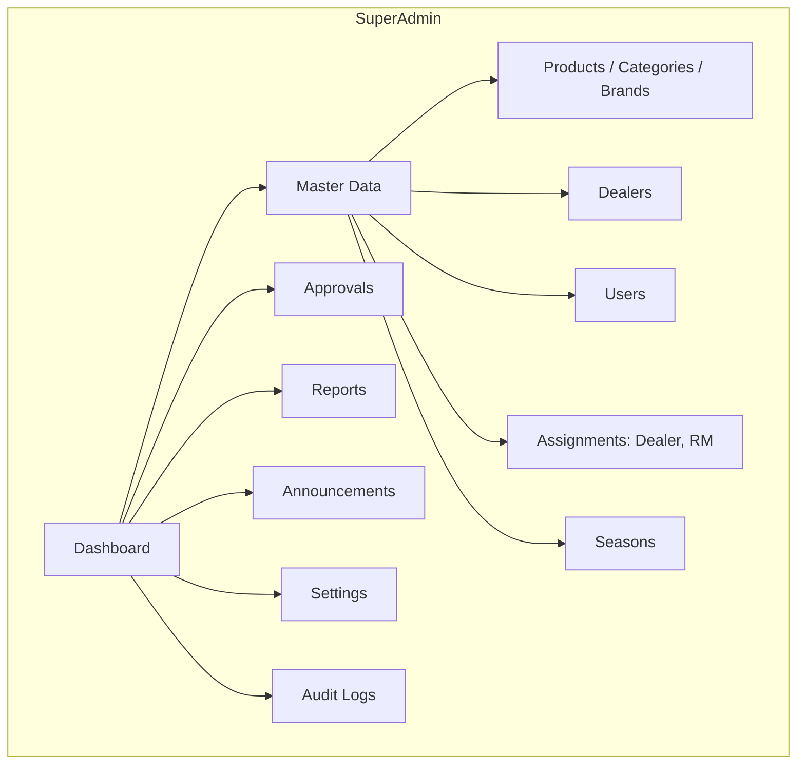

- **Super Admin:** Dashboard · Master Data (Products, Categories, Brands, Dealers, Users, Assignments, Seasons) · Approvals · Reports · Announcements · Settings · Audit Logs.
- **Regional Manager:** Dashboard · My Officers · Approvals · Reports · Announcements.
- **Sales Officer:** Dashboard · My Dealers · Seasonal Planning · Monthly Planning · Reports · Announcements.

### 23.3 Menus, breadcrumbs & flow

- **Breadcrumbs** on deep screens: e.g. `Dashboard › My Dealers › Vijasan ksk Rehti › Seasonal Planning`.
- **Contextual actions** appear on each screen (e.g. Submit on planning; Approve on a submitted plan).
- **Navigation flow** always respects scope: a Sales Officer's menu never exposes another officer's data or admin screens.

### 23.4 Mobile navigation

- Sidebar collapses into a hamburger menu.
- Season selector and user menu remain in a compact top bar.
- Dense grids become stacked cards; primary actions (Save/Submit/Approve) pinned and always reachable.

---

## 24. Application Flow

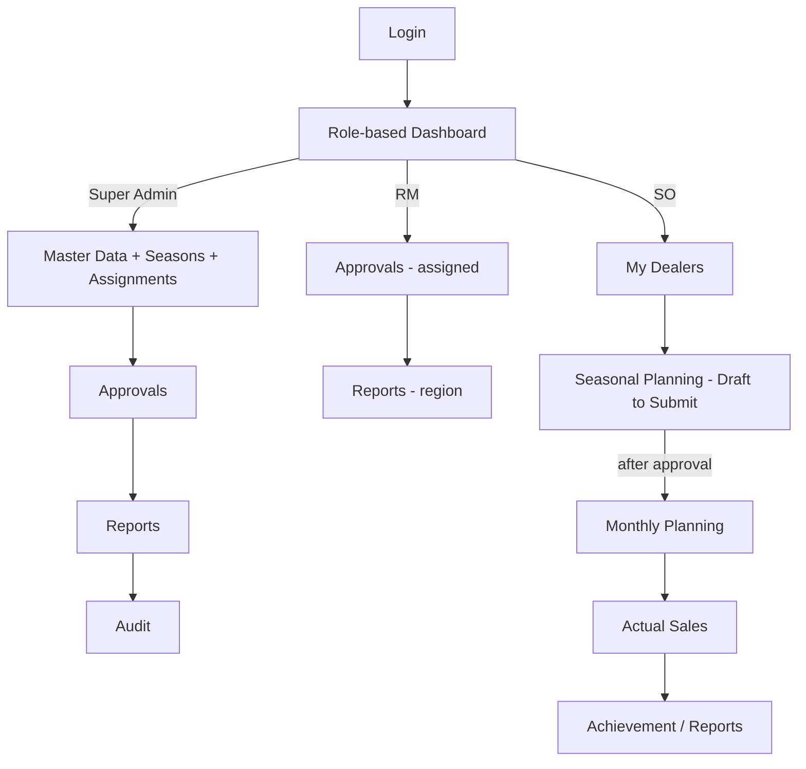

**Season lifecycle:** **Open** (planning and monthly entry allowed) → **Closed** (read-only, historical).

---

## 25. Business Rulebook (Consolidated)

The single, de-duplicated list of business rules. Each references the section with full detail.

**Structural / integrity**
- BR1. Products, Dealers and Users are **never deleted** — only deactivated; they remain in history (Sec. 13, 18).
- BR2. Historical plans, reports and prices **never change** (Sec. 9, 30).
- BR3. Dealer and RM reassignment **preserve history** via time-aware assignments (Sec. 9).
- BR4. Approved plans are **immutable**; changes create revisions (Sec. 16).
- BR5. All calculations **match Excel exactly** (Sec. 17).
- BR6. Approved plans use **snapshot** Rate/NBV% (Sec. 17.2, 30).

**Planning**
- BR7. Planning is **quantity-based**; users enter only quantities; Rate/NBV%/Amount/NBV/totals are never editable (Sec. 14, 17, 18).
- BR8. Monthly planning starts **only after** seasonal approval (Sec. 15, 18 V8).
- BR9. A season has up to **six named, ordered months** (Sec. 13, 22.11).
- BR10. Total Quantity = sum of the per-pack quantities (`PlanLinePack`, one row per active pack size); Amount = Qty × Rate; NBV = Amount × NBV% (Sec. 17, 36).
- BR11. Achievement is reported on **both Amount and NBV**, with a **zero-plan guard** (Sec. 17.8).
- BR12. **Version 1 planning is dealer-first (bottom-up):** product season totals are the automatic **sum of dealer allocations** (Sec. 14). Product-first (top-down) planning is a future enhancement (Sec. 28, 33), never forced in V1.

**Access & workflow**
- BR13. **Absolute data isolation** between Sales Officers (Sec. 9, 18).
- BR14. RMs are limited to their **own hierarchy** (Sec. 9, 18).
- BR15. Only the **Super Admin** manages master data (Sec. 6, 13).
- BR16. Inactive products/dealers/seasons cannot be used in **new** plans (Sec. 18).
- BR17. Reject/Return requires **remarks**; full approval history is retained (Sec. 16).

**Monthly planning, pricing & actual sales (confirmed decisions)**
- BR18. **Over-planning is allowed.** The sum of monthly plans MAY exceed the approved seasonal quantity; the system warns and highlights the excess but **never blocks** save, submit or approve (Sec. 15.4).
- BR19. **Approved plans snapshot Rate and NBV%.** Later master-data changes apply to future plans only; approved plans, reports, dashboards, achievement and historical seasons are never recalculated (Sec. 13, 17.4, 30).
- BR20. **Actual sales are one kind of record.** Version 1 captures them by manual entry; Version 2 adds Excel/Tally import using the same Actual Sales record, requiring no redesign (Sec. 15.5, 28).

---

## 26. Assumptions

Confirmed working assumptions (distinct from open clarifications in Section 27):

- The attached workbook is representative of every Sales Officer's workbook (same layout and calculation logic). Its 55-product list and 50 dealer sheets are **sample-file properties, not system limits** — production scale is defined in Section 1.1.
- "NBV" means Net Business Value and its percentage is a product property set centrally (pending final confirmation in Section 27 item 5).
- Pack sizes are counts of packs aggregated into one planning quantity per product. They are modelled as a configurable **Pack Size master** with per-pack quantities in `PlanLinePack` (not fixed columns); the sample workbook happened to use seven (Section 36).
- Rate and NBV% are the same for all dealers within a season (no dealer-specific pricing in the workbook).
- The 13 `Dealer 38`–`Dealer 50` sheets are spare Excel templates — an artifact of the workbook, **not** a business limit. The system imposes no 50-dealer cap (Sec. 1.1, Sec. 27 item 10).
- A separate workbook exists per season; in the web app, seasons are independent data sets.
- Month names/count define season length; the sample's first month is June for Kharif 2026-27.
- Actual sales are entered manually initially (no automated feed in the workbook).

---

## 27. Business Clarifications (Confirmation Required)

These are open decisions. Each blocks or shapes a specific module and must be confirmed before that module is built. (Where the BRD and workbook differ, the difference is recorded here rather than resolved by assumption.)

1. **Planning direction (Sec. 14): ✅ RESOLVED for Version 1 — dealer-first (bottom-up), exactly as Excel.** Product summaries are auto-calculated from dealer planning. Product-first (top-down target + allocation with "sum = target" validation) is deferred to Future Enhancements (Sec. 28, 33). No product-target/allocation screen or allocation validation in V1.
2. **Monthly cap (Sec. 15, 18 V7): ✅ RESOLVED — over-planning is ALLOWED and never blocks.** The system warns and highlights the excess for management visibility only (Section 15.4). It must not block save, submit or approve.
3. **Approval routing (Sec. 16): ✅ RESOLVED.** The route is derived automatically from the officer's **current** RM assignment. No RM → `SO → Super Admin`. RM present → `SO → RM → Super Admin`, and the **RM must approve before the Super Admin can review**. Super Admin is always the final approver; the officer never chooses the approver. The approvable unit is **one Season Plan per officer per season** (all their dealers).
4. **Revision mechanics (Sec. 16): ✅ RESOLVED.** Approved plans are immutable. A Sales Officer **requests** a revision; **only the Super Admin authorizes** it. On authorization the system copies the last approved version into a **new version** (v2) in Draft; the prior version stays permanently read-only. The Sales Officer edits the new version, which then follows the normal route (RM if applicable, then Super Admin). When approved, the new version becomes the **active** version; all prior versions remain in revision history. Monthly plans and actual sales are entered directly within the approved plan and require **no separate approval**.
5. **NBV definition & mutability (Sec. 17): ✅ RESOLVED — NBV = Net Business Value.** Rate/NBV% may change at any time; on **approval** the plan **snapshots** Rate and NBV%; changes apply to **future plans only**; approved plans, reports, dashboards and historical seasons are never recalculated (Sections 13, 17.4, 30).
6. **Pack-size semantics (Sec. 17, 36): PARTIALLY RESOLVED.** Pack sizes are now a configurable **Pack Size master** and per-pack detail **is stored** in `PlanLinePack`. Confirmed behaviour: pack quantities are summed into Total Quantity, and Amount = Total Quantity × Rate (packs do **not** individually change price). Still open: whether any pack should carry a **conversion factor** that affects Amount — if confirmed later, it becomes a field on Pack Size with no change to the table structure.
7. **Rounding & precision (Sec. 17.12):** decimals and rounding for quantities, Amount/NBV, percentages.
8. **Brands & Categories (Sec. 13):** how do the 55 products map to brands and categories (absent as columns in the workbook)?
9. **Season length / month naming (Sec. 13): ✅ RESOLVED — a season spans up to six months.** Confirmed example: Kharif 2026 = June, July, August, September, October, November. The Super Admin defines the ordered, named months when creating a season; the same season definition applies to all officers. (Remaining minor point: whether a season could ever exceed six months — treated as No for Version 1.)
10. **Dealer capacity (Sec. 13): ✅ RESOLVED — no per-officer dealer limit.** The "50 dealers" figure was an Excel template artifact. Production scale is ~1,000–3,000 dealers total (Sec. 1.1); the system must not impose a 50-dealer cap.
11. **Assignment effective periods (Sec. 9, 13): ✅ RESOLVED — explicit from–to date ranges.** Each Dealer→Officer and Officer→RM assignment carries an effective-from and an (optional, open-ended) effective-to date; ranges for the same entity must not overlap. Point-in-time historical queries use these ranges.
12. **System Settings contents (Sec. 13, 22.17):** which global settings exist (approval routing defaults, pack-size definitions, season calendar)?
13. **Audit visibility (Sec. 8, 22.18):** can RM/SO see audit history for their own scope, or Super-Admin-only?
14. **Notifications (Sec. 20):** are in-app/email notifications for submit/approve/return in initial scope?
15. **Actual sales source (Sec. 10, 12): ✅ RESOLVED — two-stage.** Version 1 = manual entry by authorized users. Version 2 = import from Excel/Tally (dealer & product alias matching, validation, duplicate prevention, import history). Manual and imported sales are the same kind of record, so no rework is needed later (Sections 15.5, 28).
16. **Dashboard KPIs (Sec. 20):** specific tiles/charts and default scope per role.
17. **Announcement targeting (Sec. 13, 22.16):** target by role, individual user, and/or region?
18. **Login identity (Sec. 22.2): ✅ RESOLVED — username login.** Users sign in with a unique **username** + password. Authentication uses **Auth.js (NextAuth v5)** credentials with hashed passwords and JWT sessions. No SSO in Version 1.

---

## 28. Future Scope

Out of initial (Version 1) scope; recorded for roadmap awareness. Build only if later approved.

- **Tally / ERP integration** — sync actual sales, products or dealers from accounting/ERP.
- **Actual sales import (Version 2)** from Excel/Tally — parse Excel files, match dealer aliases, match product aliases, validate imported data, prevent duplicate imports, and store import history. Manual entry (Version 1) and import (Version 2) write the same Actual Sales record, so no redesign is required to add it (Section 15.5).
- **Offline mode** for field entry with later sync.
- **WhatsApp / SMS / email notifications** for submissions, approvals and returns.
- **Native mobile app** optimized for field officers.
- **Forecasting** of season demand from historical seasons.
- **AI suggestions** for dealer allocation and target setting.
- **Advanced analytics** beyond core dashboards (trends, cohort comparisons).
- **Product-first (top-down) planning** — set a per-product season target, then allocate to dealers with "sum = target" validation. (Version 1 is dealer-first/bottom-up; see Section 14.)
- **Top-down target setting** per region/officer, separate from plan-vs-actual.
- **Bulk import/export** (spreadsheet) of master data and plans.
- **Multi-language UI.**

---

## 29. Development Roadmap

Phased and **runnable after every phase**. No coding begins until this specification is approved.

| Phase | Deliverable | Depends on |
|---|---|---|
| P0 | Project scaffold, base layout, auth shell | Approval of this spec |
| P1 | Auth, users, roles (M1, M2) | P0 |
| P2 | Master data: Products/Categories/Brands, Dealers, Seasons (M4, M5, M6) | P1 |
| P3 | Organization & time-aware assignments (M3) | P2 |
| P4 | Seasonal planning + Calculation Engine (M7, Sec. 17) | P2, P3 |
| P5 | Approval workflow + revisions (M9) | P4 |
| P6 | Monthly planning + actual sales + achievement (M8) | P5 |
| P7 | Reports (M10) | P4–P6 |
| P8 | Dashboards (M11) | P7 |
| P9 | Announcements, Settings, Audit history (M12, M13, M14) | P1+ |
| P10 | Hardening: validation, permissions review, historical-integrity tests, Excel-parity tests | all |

Each phase: (1) read this spec, (2) explain what will be built, (3) create only required files, (4) keep the app runnable, (5) update this spec if an approved decision changes, (6) never silently change business logic.

---

## 30. Important Implementation Notes

Business-critical rules that must survive into implementation (stated in business terms; technical design belongs in a future `TECHNICAL_ARCHITECTURE.md`).

- **Pricing by product identity, never by position** — the workbook's #1 hidden bug (positional price lookup) must not be reproduced.
- **Snapshot pricing on approved plans** — capture Rate/NBV% at approval so historical figures never change when master data is later edited.
- **Server-side permission enforcement** on every action — data isolation is a security requirement, not a UI concern.
- **Immutability of history** — approved plans, closed seasons and past reports are read-only; changes go through revisions.
- **Excel parity** — calculations validated against the workbook's outputs (parity tests in P10).
- **Soft deactivation only** — products/dealers/users are deactivated, never hard-deleted.
- **Consistent totals** — every roll-up is a pure sum of the same leaf values; totals must always reconcile across dealer → product → territory → region → company.

---

## 31. Technology Note (Minimal)

Technology is intentionally out of scope for this document. The business/functional requirements above are technology-agnostic and must be honoured by whatever stack is chosen. The initially preferred stack (Next.js, TypeScript, PostgreSQL, Prisma, Tailwind, shadcn/ui, React Query, Zod) and all architecture, data models, and API design will be specified separately in a future **`TECHNICAL_ARCHITECTURE.md`**.

**Architecture direction (confirmed).** Given the modest scale in Section 1.1 (tens of officers, low thousands of dealers, ~100 products), a **clean monolithic web application backed by a single relational database is sufficient and is the intended design.** The following are explicitly **excluded** by business direction and must not be introduced: Redis, Kafka, RabbitMQ, microservices, GraphQL, Kubernetes, event-driven architecture, event sourcing, CQRS, and any non-trivial caching layer. Priority: **simplicity, maintainability and readability** for a single maintaining developer.

---

## 32. Business Scenarios

Real-world situations and how the system must behave. Each references the governing business rule so behaviour is unambiguous.

| # | Scenario | Situation | Expected System Behaviour | Business Rule |
|---|---|---|---|---|
| 1 | **New dealer joins during a season** | A new dealer is appointed mid-season under a Sales Officer. | Super Admin creates the dealer and assigns it to the officer (effective now). The dealer appears in that officer's Dealer List and can be planned for the current open season going forward. Earlier months remain as they were. | BR15 (Super Admin owns master data); Sec. 9 (time-aware). |
| 2 | **Dealer becomes inactive** | A dealer stops trading. | Super Admin deactivates the dealer. It cannot be used for **new** planning (V4), but all its existing plans, actuals and historical reports remain intact and visible. | BR1, BR16 (deactivate, never delete). |
| 3 | **Product price changes** | Rate or NBV% of a product changes. | Super Admin edits the product. The new value applies to **future** planning only. Already-approved plans keep their snapshot Rate/NBV%, so historical figures never change. | BR2, BR6; Sec. 30. |
| 4 | **Sales Officer resigns** | An officer leaves the company. | Super Admin deactivates the user and reassigns their dealers to another officer (effective now). Historical plans/reports stay attributed to the original officer; future planning belongs to the new officer. | BR1, BR3; Sec. 9. |
| 5 | **Dealer transferred to another Sales Officer** | Dealer A moves from Officer X to Officer Y. | Super Admin records the reassignment with an effective date. Past seasons stay with Officer X; from the effective date, Dealer A's planning belongs to Officer Y. Neither officer sees the other's out-of-scope data. | BR3, BR13; Sec. 9. |
| 6 | **Sales Officer transferred to another RM** | Officer X moves from RM1 to RM2. | Super Admin records the SO→RM reassignment with an effective date. Historical regional reports stay with RM1; future roll-ups include Officer X under RM2. | BR3, BR14; Sec. 9. |
| 7 | **New season created** | A new season begins (e.g. Rabi 26-27). | Super Admin creates the season and its ordered, named months and opens it. Officers can begin seasonal planning for the new season; other seasons are unaffected (independent data sets). | BR9; Sec. 13, 22.11. |
| 8 | **Season closed** | A season ends. | Super Admin closes the season. All its plans/actuals become **read-only historical records**; no further edits are possible. Reports remain available and immutable. | BR2, BR4; Sec. 24. |
| 9 | **Plan rejected / returned** | An approver returns a submitted plan with remarks. | The plan returns to Draft, becomes editable by the owning officer, and the remarks are shown. History records the return. The officer fixes and resubmits. | BR17; Sec. 16. |
| 10 | **Plan approved** | An approver approves a plan. | The plan is locked (read-only). Monthly Planning becomes available for those dealers. Rate/NBV% are snapshotted. Any later change requires a revision. | BR4, BR6, BR8; Sec. 16. |
| 11 | **Monthly target missed** | Actual sales fall short of the month's plan. | The system shows Achievement < 100%, positive Pending Quantity and negative Variance. No data is blocked; the shortfall is simply reflected in figures, dashboards and reports. | Sec. 17.8–17.9; Sec. 20. |
| 12 | **Officer forgets to submit** | The officer leaves a plan in Draft past a deadline. | The plan stays Draft (auto-saved) and appears under "dealers needing attention" on the officer's dashboard and (as not-submitted) to the RM/Admin. The system does not auto-submit. Reminder notifications are ⚠ future scope (Sec. 27, item 14). | Sec. 20; Sec. 16. |
| 13 | **Dealer removed after planning** | A dealer is deactivated after it has been planned. | Existing plans and actuals for that dealer remain and still roll up into historical reports; the dealer just cannot be used for new planning. It is not deleted. | BR1, BR16; V25. |
| 14 | **Product discontinued** | A product is no longer sold. | Super Admin deactivates the product. It disappears from **new** plan entry but remains in existing plans and historical reports with its snapshot price. | BR1, BR16; V3. |
| 15 | **New product introduced** | A new product is added mid-season. | Super Admin creates the product with Rate and NBV%. It becomes available for planning in open seasons going forward; already-approved plans are unaffected. | BR15; Sec. 13. |

---

## 33. Version 1 Scope (In Scope vs Future Enhancements)

This section draws the definitive Version 1 boundary. Anything not listed under "In Scope" is a future enhancement and must not be built in Version 1.

### 33.1 Version 1 — In Scope

- Authentication
- Users
- Roles
- Products
- Categories
- Brands
- Dealers
- Dealer Assignment
- RM Assignment
- Seasons
- Seasonal Planning (dealer-first / bottom-up)
- Monthly Planning
- Approval Workflow
- Reports
- Dashboards
- Announcements
- Audit Logs
- System Settings

### 33.2 Future Enhancements (NOT Version 1)

Deferred; detailed in Section 28. Highlights:

- Product-first (top-down) planning with allocation validation.
- ERP integration; Tally integration.
- AI suggestions; forecasting; predictive planning.
- Native mobile app; offline mode.
- WhatsApp / SMS / email notifications.
- Advanced analytics beyond core dashboards.
- Bulk import/export; multi-language UI; external actual-sales import.

> **Rule.** Version 1 digitizes the existing Excel workflow only. Future enhancements are built later, after Version 1 is approved and delivered, and only when separately approved.

---

## 34. Specification Review Summary

Summary of changes made in this revision (v2.0 → v3.0).

**Sections Added**
- **13.1 Master Data Ownership** — table of who manages vs consumes each master.
- **19.2 Detailed Report Specifications** — per-report Purpose / Access / Columns / Filters / Sorting / Drill-down / Export / Business Use.
- **22.19 Screen Wireframes (ASCII Mockups)** — Dashboard, Dealer List, Dealer Planning, Monthly Planning, Approval, Reports.
- **32 Business Scenarios** — 15 real-world scenarios with Situation / Expected Behaviour / Business Rule.
- **33 Version 1 Scope** — definitive in-scope list vs future enhancements.
- **34 Specification Review Summary** — this section.

**Sections Updated**
- **15 Monthly Planning** — fully rewritten with a step-by-step process, the exact values shown (Approved Seasonal Qty, Already Planned, Already Sold, Remaining Qty/Amount/NBV, continuous Remaining Target / Achievement / Pending / Variance) and a complete three-month business example.
- **14 Seasonal Planning** — planning direction resolved to dealer-first for Version 1; product-first marked as future.
- **Front matter & Table of Contents** — version bumped to 3.0; Version 1 workflow note added; new sections listed.
- **25 Business Rulebook (BR12)** — updated to state dealer-first is Version 1.
- **27 Business Clarifications (item 1)** — marked RESOLVED for Version 1.
- **28 Future Scope** — product-first (top-down) planning added explicitly.

**Clarifications Made**
- Version 1 uses **dealer-first (bottom-up)** planning only; product summaries are always auto-calculated; **no mandatory product-first planning**.
- Master data is **owned solely by the Super Admin**; RM and SO are read-only consumers.
- Monthly Planning behaviour, displayed values and formulas are now explicit and worked through with numbers.

**Future Features Moved (to Sections 28 & 33)**
- Product-first / top-down planning, ERP/Tally integration, AI suggestions, forecasting/predictive planning, mobile app, offline mode, WhatsApp/SMS/email notifications, advanced analytics, bulk import/export, multi-language, external actual-sales import.

**Remaining Business Questions**
The following open items from Section 27 still require confirmation before the affected module is built. **Now resolved: items 1, 2, 5, 9, 10, 15.** Still open: 3–4 (approval routing & revision mechanics), 6–7 (pack-size semantics, rounding), 8 (brand/category mapping), 11 (assignment effective periods), 12 (system settings contents), 13 (audit visibility), 14 (notifications), 16 (dashboard KPIs), 17 (announcement targeting), 18 (login identity). None of these block starting the foundational Version 1 phases (auth, users, master data); they should be confirmed before their specific modules are built.

### 34.1 Revision v3.0 → v4.0 (Finalization)

This revision finalizes the specification for development.

- **Added Section 1.1 System Scale** with confirmed volumes (~20–40 officers, ~5–10 RMs, ~1–3 admins, ~1,000–3,000 dealers, ~100 products) and the confirmed monolith direction.
- **Resolved clarifications:** #9 (season = up to six months; Kharif 2026 = June–November) and #10 (no per-officer dealer cap; the "50 dealers" was an Excel artifact). Assumptions and Section 13 updated so 55 products / 50 dealers are described as sample-file properties, not system limits.
- **Added validations V26–V32** (unique names; no assignment to inactive officer/RM; no future-month actuals; no season close with pending approvals; non-negative monthly quantities; submit only for currently-assigned dealers; reactivation is forward-only).
- **Strengthened the architecture direction** in Section 31 (explicit monolith; explicit exclusion of CQRS/event sourcing/message brokers/caching).
- **Added Section 35 Implementation Risks & Mitigations.**
- **Version stamped 4.0 (FINAL).**

No business workflow was changed. Dealer-first planning, the approval chain, permissions and all calculations are unchanged from v3.0.

### 34.2 Revision v4.0 → v4.1 (Confirmed Business Decisions)

Three business decisions were finalized and folded in; the corresponding clarifications are now resolved and removed from the open list.

- **Monthly over-planning ALLOWED (resolves item 2).** Monthly plans may exceed the approved seasonal quantity. The system never blocks save/auto-save/submit/approve; it computes **Total Monthly Planned**, **Remaining Seasonal Quantity** (may be negative) and **Excess = Total Monthly Planned − Seasonal Target**, shows a **warning indicator**, and highlights the excess in Monthly Planning, Dealer Summary, Product Summary and dashboards. (Sections 15.4, 17.7, 18 V7, 19, 20; BR18; risk R7.)
- **Rate/NBV snapshot on approval (resolves item 5).** On approval a plan permanently snapshots Rate and NBV%; later master-data changes affect future plans only; approved plans, monthly plans, dashboards, reports, achievement and historical seasons are never recalculated. (Sections 13, 17.4, 30; BR19.)
- **Two-stage actual sales (resolves item 15).** Version 1 = manual entry; Version 2 = Excel/Tally import (dealer/product alias matching, validation, duplicate prevention, import history). Both are the same Actual Sales record, so no redesign is needed later. (Sections 10, 15.5, 28; BR20.)

No architecture or workflow was redesigned. Version stamped 4.1 (FINAL).

### 34.3 Revision v4.1 → v4.2 (Planning Data Model Normalization)

Internal database-design improvements only — **no business workflow, UI, auth, approval, permission, or technology change.** All planning behaviour and every calculation are preserved exactly.

- **Pack sizes normalized (Changes 1–2).** The seven fixed `q1`–`q7` columns on `PlanLine` are replaced by a configurable **Pack Size master** and a child **`PlanLinePack`** (one row per pack size, with quantity). Super Admin can add/deactivate pack sizes without code; the grid renders columns dynamically. (Sections 13, 14, 17, 36.)
- **MonthlyEntry integrity (Change 3).** `MonthlyEntry` now references the approved **`PlanLine`** by foreign key (plus `SeasonMonth`), instead of being keyed only by season/dealer/product business identity. (Sections 15, 36.)
- **Versioning unchanged (Change 4).** Revisions still create new `SeasonPlan` versions and now also copy `PlanLinePack`; a new version starts with no monthly entries. Approved versions remain immutable. (Sections 16, 36.)
- **PlanDealer retained (Change 5).** Kept as the dealer-first anchor and future home for per-dealer metadata; reasoning in Section 36.5.
- **Calculations unchanged in meaning (Change 6).** Total Quantity now sums `PlanLinePack` rows; Amount, NBV and all roll-ups compute exactly as before; still only inputs are stored. (Sections 17, 36.8.)

Version stamped 4.2 (FINAL). Full data model in Section 36.

### 34.4 Revision v4.2 → v4.3 (User contact fields + Dealer Import documentation)

Documentation and a small master-data addition — **no change to business workflow, planning, approval, permissions, authentication or technology.**

- **Optional User contact fields.** `User` gains two **optional** fields, **Phone** and **Email** (Email unique when present). They are administrative contact information only and **do not participate in authentication**; Username remains the sole login identity. (Sections 13, 13.1.)
- **Dealer Import & Import History documented.** The Dealer Import workflow, the **`DealerImportRecord`** audit entity, the rule that **uploaded workbooks are never stored**, and the **operational-data reassignment safeguard** are documented in the new Section 37. These describe already-implemented setup/onboarding tooling; no core entity or workflow changed. (Section 37.)

Version stamped 4.3 (FINAL). Import workflow & audit model in Section 37.

### 34.5 Revision v4.3 → v4.4 (Planning Configuration — input modes)

An additive planning extension — **the planning workflow, approval chain, permissions, versioning, snapshots and technology are unchanged.** Only the *input method* on the planning screens becomes configurable.

- **Configurable input modes.** A new admin screen (*Master Data → Planning Configuration*) lets the Super Admin choose, independently for **Seasonal** and **Monthly** planning, one of four modes: **Pack Size** (current behaviour), **Total Quantity**, **Amount**, or **NBV**. The planning grids render dynamically to match. (Section 38.)
- **Default vs per-season source of truth.** The global `SystemSetting` values (keys `planning.seasonalMode`, `planning.monthlyMode`) are only the **default**. Each **Season** stores its own `seasonalMode`/`monthlyMode`, prefilled from the default at creation and fixed thereafter; planning, monthly planning, approvals and reports always use the **season's** modes. Changing the default never alters existing seasons or historical reports. Defaults are **Pack Size** so an un-configured system is identical to before.
- **Minimal, additive schema.** `PlanLine` gains nullable `inputMode` + `inputValue`; `MonthlyEntry` gains nullable `inputMode` + `planValue` + `saleValue`. All null on existing rows, so historic Pack-Size data stays valid and continues to compute exactly as before. The planning tables are **not** redesigned. (Section 38.4.)
- **Calculations stay centralized.** All mode math lives in `lib/calc` (`figuresForMode`): every mode still resolves to the same three figures (Total Qty, Amount, NBV) using the existing formulas; no new business math is introduced. Amount/NBV modes leave quantity blank rather than inventing fractional pack counts. (Section 38.3.)
- **Reports adapt.** Reports and exports read plan figures through the same centralized calc and compare the values available in the active mode (Qty vs Qty, Amount vs Amount, NBV vs NBV). (Section 38.5.)

Version stamped 4.4 (FINAL). Full behaviour in Section 38.

### 34.6 Season creation UX refinement (within v4.4)

A UX/safety refinement of Season creation and management — **no change to the planning engine, reports, approval flow, or the Season/SeasonMonth/planning-mode concepts.** Documented in Sections 13 and 38.7–38.8.

- **Period-based creation.** Seasons are created from **Start month/year → End month/year**; `SeasonMonth` rows are **auto-generated** (no free-text month entry), spanning year boundaries, validated (End ≥ Start, 1–12 months, no duplicates), with a live month **preview** before saving.
- **Additive schema.** New nullable `Season.startMonth/startYear/endMonth/endYear`; `SeasonMonth` reused unchanged; existing seasons stay valid (Period falls back to the month list).
- **Edit locking.** Period and planning modes are frozen once a season holds any operational data (any Season Plan); enforced on both client and server, so historical seasons are never altered.
- **Season list & monthly UX.** The list shows Season · Period · Seasonal Mode · Monthly Mode · Status; the Monthly Planning tab now shows a locked message and the workflow instead of being a dead disabled tab.

Version remains 4.4 (FINAL) — this is a UX refinement of existing concepts, not a workflow or architecture change.

### 34.7 Planning Management System — modular planning + Seasonal Plan Import (within v4.4)

An additive **reorganisation** of Planning into a parent module hosting multiple planning systems, plus a complete **Seasonal Plan Import**. Existing Sales Planning behaviour (dealer-first planning, calculations, approvals, revisions, snapshots, monthly, reports) is **unchanged and reused**, not redesigned. Documented in Section 39.

- **Planning is now a parent module** with sub-modules: **Sales Planning** (functional), **Recovery / Scheme / Party Planning** (navigation + page + permission placeholders showing “Coming Soon”). New modules can be added without further redesign.
- **Sales Planning** presents **Seasonal / Monthly / Yearly** planning types (tabs) and a common **Create Sales Plan** dialog. Yearly = a single total yearly target (no month breakdown), reusing the seasonal engine.
- **Additive schema:** `SeasonPlan.planningType` (default SEASONAL), `versionName`, `description`, `source` (MANUAL/IMPORT); unique key now includes `planningType`; new `SeasonPlanImportRecord` audit table. All existing rows default to SEASONAL/MANUAL and are unchanged.
- **Seasonal Plan Import** loads the company's existing Excel workbook into a Season Plan: skip Price List / Product Plan / Dealer Summary, read every dealer sheet, match dealer/product/pack size to masters, preview counts + warnings (missing dealers/products, unknown pack sizes, duplicates), validate, and commit **in one transaction** to an ordinary DRAFT `SeasonPlan` (source = IMPORT). Imported plans then behave exactly like manual ones (approvals, monthly, reports, history).

Version remains 4.4 (FINAL) — a modular reorganisation and a new import path over the same planning engine, not a change to the planning workflow or calculations.

### 34.8 Workbook-faithful Sales Planning + corrected planning metrics (within v4.4)

Business clarifications after reviewing the company's real Seasonal Planning workbook. These are **authoritative and override the Excel workbook's formulas wherever they conflict**, and supersede any earlier phrasing of the same metrics. The planning engine, approvals, reports, versioning and snapshots are reused unchanged. Full detail in Section 40.

- **Corrected metrics.** **Pending Qty = Season Target − Actual Sales** (how much is left to achieve). **Season‑vs‑Month Difference = Season Target − Total Monthly Planned** (quantity not yet allocated to months). Both are phrased so users are not confused by negative numbers in normal use. These replace the workbook's `Actual−Target` and `Monthly−Target`.
- **Month‑based actuals, one record, two writers.** Actual Sales are always per‑month and per‑product; season actuals are the **sum of monthly actuals** (never entered/imported at season level). Version 1 keeps **Manual Actual Sales entry** (permissioned): a user types **Month Sale Qty** and the engine derives Sale Amount, Actual NBV, Achievement, Pending, Difference and season totals. A future **Tally Import** (one file per month) writes to the **same** `MonthlyEntry` records — Manual Entry OR Tally → the one Monthly Actual Sales store → the one calculation engine. There are never two actual‑sales systems.
- **Two seasonal‑import modes (migration only).** *Seasonal Only* (pack quantities) and *Complete Workbook* (pack quantities **+ existing Monthly plan quantities**). Neither imports Actual Sales, Live Monthly, Pending or Difference (all app‑generated). Import exists solely to migrate already‑completed Excel work; **Create Sales Plan is the primary workflow** for all future seasons.
- **Pack Size master matches the workbook exactly:** `1,2 & 5 LTR/KG`, `500 ML/KG`, `250 ML`, `100 ML`, `50 ML`, `25 ML`, `10/15 ML` — imported/mapped directly without prompting.
- **Two experiences:** an editable **Planning Mode** (only editable fields — seasonal packs, monthly plan qty) and a read‑only **Workbook View** (the digital replacement of the Excel sheet: per‑dealer Progress Summary → Season Summary → Monthly Sections). Product Plan and Dealer Summary remain **computed** roll‑ups (Reports), never stored.
- **Manual == Imported.** A plan created manually and one migrated from Excel are identical afterwards; the rest of the app has no separate code path for imported plans.

Version remains 4.4 (FINAL) — workbook-faithful screens and corrected metric definitions over the same engine; no workflow, permission or storage redesign.

### 34.9 Company Onboarding — source-agnostic migration orchestration (within v4.4)

Adds a first-run onboarding layer that gets a company off Excel without pre-creating masters by hand. Full detail in Section 41.

- **Onboarding is an orchestrator, not a new engine.** It sequences the **existing, independent** services — Pack Size setup, Product Import, Dealer Import, Sales Officer creation, Season creation, Seasonal Plan Import, Approval — and never merges or duplicates them.
- **Source-agnostic.** Excel workbook is the first onboarding **source**; CSV, ERP/API and manual setup are future sources that plug into the same pipeline (Organization → Pack Sizes → Products → Dealers → Officer → Season → Planning Import → Completion) without architectural change.
- **Detect-and-offer.** Onboarding detects what is missing and defaults to **creating** it (pack sizes, products from PRICELIST, dealers from sheets, officer from filename, season proposed from the workbook), always surfacing **possible existing matches** so the admin can map instead of creating duplicates.
- **Idempotent + atomic.** Master data is created via **idempotent upserts** (safe to re-run — no duplicate products/dealers/pack sizes); once prerequisites exist, the Sales Plan is created in a **single transaction**, so onboarding is resumable if interrupted.
- **Migration report.** Onboarding produces a downloadable, permanently stored report (Created / Matched / Skipped / Warnings) retained in Import History.
- **Masters owned in-app after onboarding.** The workbook is authoritative only during onboarding; afterwards Products, Dealers, Pack Sizes and Seasons are managed in the app, and future seasonal planning never depends on a workbook.
- **Import Seasonal Plan stays lightweight.** It continues to assume masters exist; onboarding calls it internally after creating them.

Version remains 4.4 (FINAL) — an orchestration layer over existing services; no change to the planning engine, calculations, approvals or storage semantics.

### 34.10 Open-Month Control — planning-state lifecycle (within v4.4)

Formalises the workbook's implicit "work the current month" process into an explicit, management-controlled month lifecycle. No calculation, report or approval change. Full detail in Section 42.

- **Per-month lifecycle.** `SeasonMonth` gains a `status`: **LOCKED** (not yet opened), **OPEN** (management opened it for entry), **CLOSED** (opened then closed; read-only). New app-created seasons **auto-open the first month** (derived from the period) and LOCK the rest; imported seasons additionally auto-open months that received imported plan data; existing seasons default to OPEN (no regression).
- **Single rule source.** A centralized planning-state module (`features/planning/planning-state`) owns the rule "only an OPEN month accepts entry." Monthly Planning (plan quantity + actual sales) is the one enforcement point (`assertMonthOpen`); there are no scattered `if (monthOpen)` checks.
- **Management action.** Super Admin opens / closes / reopens months (state machine: LOCKED→OPEN, OPEN→CLOSED, CLOSED→OPEN), audited. Supports multiple open months and reopening previous months without redesign.
- **Unchanged elsewhere.** Reports/Dashboards aggregate all months regardless of status; the approval workflow is untouched; imports/onboarding write monthly data directly (migration) and intentionally bypass the gate. The calculation engine is not modified.

Version remains 4.4 (FINAL) — an editability lifecycle over the existing monthly data; no workflow, calculation or storage-semantics redesign.

---

## 35. Implementation Risks & Mitigations

Risks that could cause the built system to diverge from the business intent, with the mitigation each requires. These are engineering-discipline notes, not new requirements.

| # | Risk | Impact | Mitigation |
|---|---|---|---|
| R1 | **Positional pricing reproduced** — linking plan lines to products by order/index instead of identity. | Silent mispricing, the workbook's worst bug. | Bind every plan line to a product by identity; never by position (Sec. 3, 30). Covered by Excel-parity tests. |
| R2 | **Prices change history** — editing a product's Rate/NBV% alters already-approved plans/reports. | Historical figures shift; audits fail. | Snapshot Rate/NBV% onto approved plans; reports for closed seasons read snapshots only (Sec. 13, 30). |
| R3 | **Permission leakage** — scope enforced only in the UI. | An officer could reach another officer's data. | Enforce scope on the server for every read/write (V16–V18); test with cross-officer attempts. |
| R4 | **Reassignment corrupts history** — moving a dealer/officer retro-attributes past records. | Historical reports change owners. | Time-aware assignments; historical queries use the ownership effective at that time (Sec. 9, V20). |
| R5 | **Rounding drift** — summing rounded values instead of rounding at display. | Totals disagree across levels. | Keep full precision internally; round only for display; reconcile dealer→company (Sec. 17.12, 30). |
| R6 | **Approved plans become editable** through an overlooked path. | Loss of immutability and trust. | Single enforced state machine (Draft→Submitted→Approved); approved edits only via revision (V13, Sec. 16). |
| R7 | **Over-plan not surfaced** — monthly plans exceed the approved season quantity but the excess is not shown. | Management loses visibility of over-planning. | Over-planning is allowed by rule (Sec. 15.4); always compute and highlight the excess in Monthly Planning, Dealer/Product Summary and dashboards. Never block. |
| R8 | **Concurrent edits** — the same plan edited in two tabs/users. | Lost updates. | Simple last-write protection / optimistic check at save; not a distributed-locking system. |
| R9 | **Season/month misconfiguration** — wrong or unordered months. | Planning grid misaligned. | Validate season months (V24); Super Admin confirms before opening a season. |
| R10 | **Building beyond Version 1** — adding future-scope features early. | Scope creep, delay, complexity. | Hold strictly to Section 33 (Version 1 Scope); future items only when separately approved. |

---

## 36. Planning Data Model (Phase 2 Architecture)

This section is the source of truth for the **planning** data structures. It reflects the normalized pack-size design and the tightened `MonthlyEntry` integrity. Business behaviour and all calculations are unchanged; only the internal structure improves. Phase-1 master tables (User, Dealer, Product, Category, Brand, Season, SeasonMonth, etc.) are unchanged.

### 36.1 Entities

| Entity | Purpose | Key fields (business-level) |
|---|---|---|
| **PackSize** (master) | Configurable set of pack sizes used in planning; replaces the workbook's seven fixed columns. Managed by Super Admin. | name (e.g. "1 Kg", "500 ml"), displayOrder, isActive, createdAt, updatedAt |
| **SeasonPlan** | The approvable unit — one per officer per season, per **version**. | seasonId, officerId, version, status, isActiveVersion, supersedesId, revisionRequested, revisionReason, submittedAt, approvedAt, lastSavedAt |
| **PlanDealer** | Dealer-first grouping inside a plan; the anchor for a dealer's product lines (and future per-dealer metadata). | seasonPlanId, dealerId |
| **PlanLine** | One product row within a dealer's plan. Holds the **price snapshot** captured at approval. | planDealerId, productId, rateSnapshot, nbvPercentSnapshot |
| **PlanLinePack** | The **quantity** the officer enters for one pack size on a plan line. One row per active pack size. | planLineId, packSizeId, quantity |
| **MonthlyEntry** | Monthly planned qty and actual sale qty for an **approved** plan line, per month. | planLineId (FK), seasonMonthId (FK), planQty, saleQty |
| **ApprovalAction** | Immutable status-timeline event on a plan. | seasonPlanId, actorId, action, fromStatus, toStatus, remarks, createdAt |

> **Only inputs are stored:** `PlanLinePack.quantity`, `MonthlyEntry.planQty/saleQty`, and the price snapshot on approval. Every amount, NBV, total, summary, achievement, variance and remaining figure is **computed** (Section 36.8).

### 36.2 ER Diagram

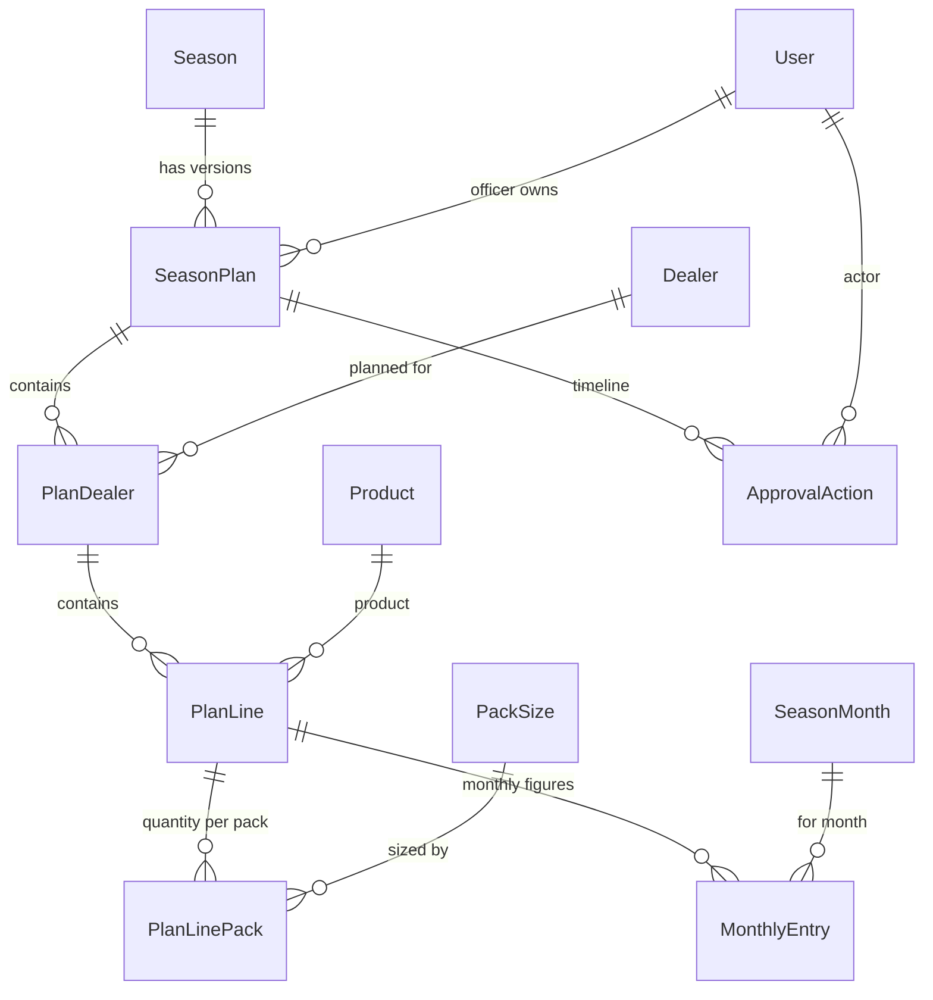

### 36.3 Relationships

- A **Season** and an officer (**User**) have many **SeasonPlan** versions; each version is unique on (season, officer, version).
- A **SeasonPlan** has many **PlanDealer** rows (one per dealer in the plan); each links to a **Dealer**.
- A **PlanDealer** has many **PlanLine** rows (one per product); each links to a **Product** and carries the approved price snapshot.
- A **PlanLine** has many **PlanLinePack** rows — one quantity per **PackSize** — unique on (planLine, packSize).
- A **PlanLine** has many **MonthlyEntry** rows — one per **SeasonMonth** — unique on (planLine, seasonMonth).
- A **SeasonPlan** has many **ApprovalAction** rows (append-only timeline), each by an actor (**User**).

### 36.4 Pack-size normalization (Changes 1–2)

Pack sizes are no longer hard-coded columns. **PackSize** is a Super-Admin master (name, display order, active flag); the planning grid renders one column per **active** pack size in display order. Each product row's per-pack quantity lives in **PlanLinePack** (`planLineId`, `packSizeId`, `quantity`, unique per pair). Adding or deactivating a pack size is a data change with no code change, and the model no longer assumes exactly seven. This keeps the design normalized and future-proof while the calculations stay identical (the sum simply ranges over `PlanLinePack` rows instead of seven columns).

**Management surface.** Pack Sizes are maintained through the standard master-data management screen — list, search, create, edit and deactivate — exactly like Categories and Brands (Sections 13, 13.1, 22). **Immutability note:** the active flag only controls which pack columns are offered for new entry; quantities already stored in `PlanLinePack`, including on approved plans, are always included in totals regardless of the flag (Section 30).

### 36.5 PlanDealer — retained (Change 5), with reasoning

`PlanDealer` is **kept**. It is more than a grouping convenience:

- It is the **dealer-first anchor** — the parent under which a dealer's product lines and totals live, matching the "one worksheet per dealer" workflow and the per-dealer UI.
- It records the **exact dealer set** of a plan version at creation time, which is needed for historical accuracy when assignments later change (Section 9, V20).
- It is the natural, forward-compatible **home for per-dealer metadata** the business may add later — dealer remarks, per-dealer completion/lock status, or per-dealer statistics — without touching every product line.
- Merging `dealerId` into `PlanLine` would repeat the dealer on ~100 product rows per dealer and scatter any future dealer-level attribute across those rows.

No metadata fields are added now (no confirmed requirement), but `PlanDealer` remains the correct place for them. Net: keeping it is cleaner for long-term maintenance.

### 36.6 MonthlyEntry ↔ PlanLine (Change 3)

`MonthlyEntry` now carries a **foreign key to `PlanLine`** (plus a foreign key to `SeasonMonth`), rather than being identified only by (season, dealer, product). This is safe and strict because monthly planning begins **only after approval**, and a revision creates a new version that **copies the plan lines and starts with no monthly entries** — so every monthly entry belongs to exactly one approved plan line. The dealer, product and season plan are reached by navigating `MonthlyEntry → PlanLine → PlanDealer → SeasonPlan`, so the previously duplicated identity columns are dropped in favour of a single enforced relationship (unique on planLine + month).

### 36.7 Versioning & immutability (Change 4 — unchanged)

Versioning is exactly as before. Each **SeasonPlan** is a discrete version (unique on season + officer + version). Approval snapshots prices onto that version's **PlanLine** rows and marks it APPROVED/active. A revision (Super-Admin-authorized) creates a **new** SeasonPlan (version + 1) that copies **PlanDealer → PlanLine → PlanLinePack** and the plan structure; it starts with **no MonthlyEntry** rows and edits only the new version. Prior versions keep their lines, packs and snapshots untouched; `ApprovalAction` remains append-only. Approved versions are never modified (BR2, BR4, V13, V19).

### 36.8 Calculation from the normalized model (Change 6)

Meaning is unchanged; only the source of Total Quantity changes.

```
TotalQuantity (per plan line) = SUM(PlanLinePack.quantity) over all of the line's PlanLinePack rows
Amount                        = TotalQuantity × Rate        (Rate = snapshot once approved)
NBV                           = Amount × NBV%
ProductSummary                = SUM over PlanLines grouped by product   (bottom-up, auto)
DealerSummary                 = SUM over PlanLines grouped by dealer
SeasonSummary                 = SUM over all dealers
Monthly (per line/month)      = remaining/excess/achievement/variance from MonthlyEntry vs approved TotalQuantity
```

No amounts, totals, summaries, variance, achievement or remaining values are stored; all are computed from the stored inputs (Sections 17, 30).

### 36.9 Migration impact from the previous Phase 2 design

Phase 2 has not yet been deployed with production data, so this is primarily a schema redefinition; the notes below also cover any dev/test data.

- **Add `PackSize`** master and seed it with the pack sizes in use (at minimum the seven historical buckets, preserving their meaning; finer splits such as separating 1/2/5 Kg are a later master-data edit).
- **Add `PlanLinePack`**; **remove `q1`–`q7`** from `PlanLine`. For any existing plan lines, back-fill one `PlanLinePack` row per non-zero pack quantity mapped to the matching `PackSize`.
- **Alter `MonthlyEntry`:** add `planLineId` FK; back-fill it by resolving each entry's (seasonPlan → planDealer[dealer] → planLine[product]); then **drop** the old `seasonPlanId`, `dealerId`, `productId` identity columns; set the unique key to (planLine, seasonMonth).
- **Calculation engine:** Total Quantity now sums `PlanLinePack`; all downstream formulas are unchanged.
- **Revision copy logic:** also copy `PlanLinePack` when creating a new version (monthly entries are still not copied).
- **No change** to auth, permissions, approval workflow, UI behaviour, or the Phase-1 master tables.

---

## 37. Dealer Import & Import History

This section documents the **Dealer Import** setup/onboarding tooling and its audit model. It is an administrative convenience for seeding the system from the company's existing Sales-Officer planning workbooks; it introduces **no new planning behaviour** and reuses the existing Users, Dealers and time-aware Assignment services (Section 9). Only the Super Admin can import.

### 37.1 What the import does

The admin uploads a Sales Officer's planning workbook (`.xlsx` / `.xls`). Each dealer worksheet is offered as a dealer; master/summary sheets are ignored by default. The Sales Officer is auto-detected (from the filename and the master sheets) and matched to an existing user, or a new Sales Officer can be created. On commit, dealers are created (or matched to existing dealers) and a **Dealer → Sales Officer** assignment is applied for each, in a single all-or-nothing transaction.

**Workbooks are never stored.** The uploaded file is parsed **in memory** only. Its bytes are never written to the database or to disk; once the import transaction completes (or fails), the file content is discarded. Only **import metadata** — never the workbook itself, and never its raw dealer/price rows — is retained, and only for audit purposes (Section 37.3).

### 37.2 Optional Sales Officer contact capture

When a new Sales Officer is created during an import, the admin may optionally supply **Phone** and **Email** alongside Name and Username. Per Section 13, these are administrative contact fields only and are **not** used for authentication; Username plus password remain the sole login credentials.

### 37.3 Dealer Import History — the `DealerImportRecord` entity

Every import attempt writes exactly one **audit record**, viewable under *Master Data → Import History* (Super Admin only). This is a metadata-only log; it never contains the uploaded workbook or its rows.

| Field | Meaning |
|---|---|
| **Import Date** | When the import ran (timestamp). |
| **Imported By** | The Super Admin user who ran the import. |
| **Workbook Name** | The original file name only (for identification) — **not** the file contents. |
| **Status** | Outcome of the run: **Completed**, **Failed**, or **Rolled Back**. |
| **Created Dealers** | Count of dealers newly created. |
| **Updated Dealers** | Count of existing dealers matched and updated (e.g. re-linked). |
| **Reassigned Dealers** | Count of existing dealers moved from one Sales Officer to another. |
| **Skipped Dealers** | Count of sheets/dealers the admin chose not to import. |
| **Sales Officers Created** | Count of new Sales Officers created during the import. |
| **Validation Errors** | Blocking problems found (a run with errors does not commit). |
| **Warnings** | Non-blocking advisories (e.g. reassignments, possible duplicates). |

Counts and messages are stored as summary metadata on the record. Because imports commit in one transaction, a **Failed** or **Rolled Back** run leaves no partial data — only the audit record explaining what happened.

### 37.4 Operational-data reassignment safeguard

Reassigning a dealer that already carries operational history is allowed but must be **deliberate**. When an existing dealer that already has operational data — **Season Plans, Monthly Plans, Actual Sales, or Approval History** — is about to be reassigned to a different Sales Officer, the system shows a **prominent confirmation dialog before commit** that:

- summarizes the dealer's existing data (counts of **Seasonal Plans**, **Monthly Plans**, **Actual Sales** and **Approval History**);
- explains that **historical records remain unchanged and correctly attributed to the original Sales Officer** (time-aware assignments, Section 9, R4/V20), while **future ownership** of the dealer belongs to the newly assigned Sales Officer from the effective date; and
- lets the admin **Proceed** or **Cancel**.

The safeguard is **informational, not a block**: after the admin confirms, the reassignment proceeds normally. Dealers with no operational data are reassigned without any prompt. This reuses the existing planning and assignment services — no data is moved, rewritten or duplicated; only a new assignment period is opened while the prior period is closed (Section 9).

---

## 38. Planning Configuration (Input Modes)

By default the planning grids are pack-size based. This section makes the **input method configurable** by the Super Admin, without changing the planning workflow, calculations, approval flow, reports or database design. It is a Version 1 extension of the planning module (Section 36), not a redesign.

### 38.1 Admin screen

*Master Data → Planning Configuration* (Super Admin only) exposes two independent choices:

```
Planning Configuration
-------------------------------------
Seasonal Planning     (●) Pack Size  ( ) Total Quantity  ( ) Amount  ( ) NBV
Monthly Planning      (●) Pack Size  ( ) Total Quantity  ( ) Amount  ( ) NBV
[ Save ]
```

The two settings are **independent** — Seasonal and Monthly can use different modes. They are stored in the existing `SystemSetting` table under `planning.seasonalMode` and `planning.monthlyMode`; there is no configuration table. If unset, both default to **Pack Size** (identical to prior behaviour).

**These global settings are only the DEFAULT — they are not the source of truth used during planning.** Each **Season** carries its own `seasonalMode` and `monthlyMode`, which are **prefilled from these defaults when the season is created** and then **fixed for the life of that season**. Everything downstream — the planning grid, monthly planning, approvals and reports — reads the **season's** stored modes, never the current global default. Consequently, changing the global default only affects **future** seasons and can never alter an existing season or its historical reports. Season modes are chosen (prefilled, editable) on the New Season screen and are fixed after creation.

### 38.2 The four modes

| Mode | Officer enters | Seasonal grid columns |
|---|---|---|
| **Pack Size** | A quantity for every configured pack size (current behaviour). | Product · one column per active pack size · Total Qty · Amount · NBV |
| **Total Quantity** | One Total Quantity per product. | Product · Total Qty (input) · Amount · NBV |
| **Amount** | A planned Amount per product. | Product · Amount (input) · NBV (derived) |
| **NBV** | A planned NBV per product. | Product · NBV (input) · Amount (derived) |

The planning screens change automatically to match the selected mode. The Monthly Planning screen behaves identically, driven by the Monthly setting: a quantity per month for Pack Size / Total Quantity, or a value per month for Amount / NBV, with the season target re-expressed in the active unit.

### 38.3 Calculations (centralized, no invented math)

All mode math lives in one place — `lib/calc.figuresForMode(mode, value, rate, nbv%)` — and every mode resolves to the same three figures using the existing formulas (Sections 17, 36.8):

- **Pack Size / Total Quantity:** quantity is the input; `Amount = Qty × Rate`, `NBV = Amount × NBV%`.
- **Amount:** amount is the input; `NBV = Amount × NBV%`. **Quantity is left blank** — it is not back-computed, to avoid inventing fractional pack counts.
- **NBV:** nbv is the input; `Amount = NBV ÷ NBV%` when `NBV% > 0` (an exact inversion of the NBV formula), else blank. Quantity is left blank.

Roll-ups (dealer, product, season, report totals) sum these figures; a figure a mode cannot produce is shown blank rather than as a misleading zero.

### 38.4 Data model (minimal, additive, backward-compatible)

No planning table is redesigned. The per-season modes plus two nullable line/entry extensions capture non-pack input while keeping every existing row valid:

| Table | New fields | Meaning |
|---|---|---|
| **Season** | `seasonalMode`, `monthlyMode` (default `PACK_SIZE`) | The modes this season uses for its whole life. Prefilled from the global default at creation; never changed by later default edits. A migrated pre-existing season defaults to `PACK_SIZE`, preserving its original behaviour. |
| **PlanLine** | `inputMode`, `inputValue` (nullable) | `inputMode = null` ⇒ Pack Size (quantities in `PlanLinePack`, as before). Otherwise the single entered number (Total Qty / Amount / NBV) is in `inputValue`. |
| **MonthlyEntry** | `inputMode`, `planValue`, `saleValue` (nullable) | `inputMode = null` ⇒ quantity mode (use `planQty`/`saleQty`, as before). For Amount/NBV the per-month values are in `planValue`/`saleValue`. |

**Precedence.** The season's mode drives what a Sales Officer enters and how the grid renders. Each `PlanLine`/`MonthlyEntry` also records the mode it was *saved* under, so even within a season a row is always interpreted by its own stored mode (robust if a season's mode were ever corrected). The global `SystemSetting` values are consulted **only** when creating a new season.

Each line/entry records the mode it was **saved** under, so changing the global configuration later never reinterprets or corrupts already-saved data. Existing Pack-Size plans (all rows `inputMode = null`) continue to work and calculate exactly as today (**backward compatibility**). A revision copies a line's `inputMode`/`inputValue` so the new version starts from the same figures.

### 38.5 Reports, approvals, imports

- **Reports** read plan figures through the same centralized calc and compare the values available in the active mode (per the request: Total Quantity → Planned Qty vs Actual Qty; Amount → Planned Amount vs Actual Amount; NBV → Planned NBV vs Actual NBV). The monthly report's column labels/units follow the Monthly mode. Excel export is unchanged — it consumes the same report payload.
- **Approvals** are entirely unchanged; only the input method differs, never the routing, states, snapshots or permissions.
- **Imports** (Dealer Import Wizard, Product Price Import) are unchanged.

### 38.6 Assumptions & limitations

- Amount and NBV modes intentionally do **not** reconstruct pack-level quantities from a value (quantity is shown blank), because a single amount cannot be uniquely decomposed into pack sizes; this avoids inventing business data.
- When Seasonal and Monthly modes differ and a monthly target cannot be derived from the seasonal figure (e.g. Monthly = Quantity but Seasonal = Amount, so no seasonal quantity exists), the monthly target is treated as 0 — over-plan highlighting simply does not apply, and nothing is blocked.
- Switching modes affects planning screens edited from that point on; previously saved lines keep their own stored mode and remain valid.

### 38.7 Season creation & management UX (period-based)

The Season creation workflow is period-based; the admin **never types month names**. This is a UX/safety refinement only — the Season, SeasonMonth, planning-mode and approval concepts are unchanged.

- **Season period, not free text.** A season is defined by **Name**, **Start month + Start year**, and **End month + End year** (e.g. *Kharif — June 2026 → November 2026*; *Rabi — December 2026 → March 2027*).
- **Auto-generated months.** The system generates one `SeasonMonth` per calendar month in the period, in order, spanning year boundaries (Dec 2026 → Mar 2027 ⇒ December, January, February, March). The admin never maintains the month list by hand. Generation is a shared function used by both the live preview and the server, so they can never disagree.
- **Validation.** End must not precede Start; **1–12 months**; a span of ≤ 12 consecutive months inherently has **no duplicate month names**; invalid ranges are rejected with a clear message.
- **Preview before saving.** The New Season screen shows the exact months that will be created (e.g. *June, July, August, September, October, November*) as the admin adjusts the period.
- **Planning modes (unchanged architecture).** Seasonal and Monthly modes are shown, **prefilled from the global Planning Configuration default** (Section 38.1) and **stored on the season**.
- **Period stored on the season.** New nullable `Season.startMonth/startYear/endMonth/endYear` capture the period (used for the *Period* column and for editing); `Season.year` continues to mirror the start year for the label and unique key. `SeasonMonth` is reused unchanged.
- **Locking (edit safety).** A season is editable only while it holds **no operational data** — where operational data means any Season Plan (draft or later), monthly plan, actual sale, or approval history; in this model the presence of any `SeasonPlan` is the lock. Once locked, **Start/End period and both planning modes are frozen** (the admin may still rename); the UI shows *“This season already contains planning data. Season period and planning modes can no longer be changed.”* The server enforces the same rule, so historical seasons can never be altered.
- **Season list.** Columns: **Season · Period (e.g. Jun 2026 → Nov 2026) · Seasonal Mode · Monthly Mode · Status**, with a lock indicator on seasons that hold data.
- **Migration.** Existing seasons keep their `SeasonMonth` rows; the new period fields are null and the *Period* column falls back to listing the months, while the modes default to Pack Size (Section 38.4). Nothing about existing seasons changes.

### 38.8 Monthly Planning availability (UX)

Monthly Planning still unlocks **only after the seasonal plan is approved** (unchanged rule, Section 15 / V8). The tab is no longer a dead disabled control: it is clickable and, until the plan is approved, shows a clear locked message plus the workflow — *Seasonal Planning → Submit for Approval → Approved → Monthly Planning Opens → Actual Sales* — with the plan's current step highlighted. No workflow, permission or data behaviour changes.

---

## 39. Planning Management System (Modular Planning) & Seasonal Plan Import

Planning becomes a **parent module** hosting multiple planning systems. This is an organisational layer over the **existing** Sales Planning engine — dealer-first planning, the calculation engine (`lib/calc`), the approval workflow, revisions, snapshots, monthly planning and reports are all **reused unchanged**. New planning modules can be added later without redesigning the system.

### 39.1 Module structure

```
Planning
├── Sales Planning      (functional)
├── Recovery Planning   (placeholder — Coming Soon)
├── Scheme Planning     (placeholder — Coming Soon)
└── Party Planning      (placeholder — Coming Soon)
```

Clicking **Planning** shows the module list (not the seasonal grid directly). Each module has its own navigation entry, page and RBAC resource (`salesPlanning`, `recoveryPlanning`, `schemePlanning`, `partyPlanning`, plus `planImport`). Recovery/Scheme/Party render a **Coming Soon** placeholder in Phase 1; no business logic is implemented for them.

### 39.2 Sales Planning module

Sales Planning presents three **planning types** as tabs — **Seasonal**, **Monthly**, **Yearly** — each listing plans of that type. A single **Create Sales Plan** dialog collects: **Planning Type**, **Planning Mode** (read-only, defaulted from the selected season per Section 38 — the season remains the source of truth), **Season**, **Sales Officer** (Super Admin creating on behalf; an officer plans for themselves), optional **Version Name** and **Description**. All types share the same structure, calculation engine, approval flow and reports.

**Yearly planning (V1)** represents a single **total yearly target** with no month breakdown: it reuses the seasonal grid/engine and simply omits the Monthly Planning tab. Monthly and Seasonal types keep the full tab set.

`SeasonPlan` gains `planningType` (SEASONAL/MONTHLY/YEARLY, default SEASONAL), `versionName`, `description`, and `source` (MANUAL/IMPORT); the version unique key becomes `(season, officer, planningType, version)`. Existing plans default to SEASONAL/MANUAL — no behaviour change.

### 39.3 Seasonal Plan Import

Because seasonal planning was historically completed in Excel, admins can import a completed workbook instead of re-keying it. Menu: **Sales Planning → Import Seasonal Plan** (Super Admin only).

**Workflow:** Upload Excel → detect workbook → choose Season → choose Sales Officer (auto-detected from filename when possible) → Preview → Validate → Import.

**Reading.** Supports `.xlsx`/`.xls` (reuses the shared SheetJS reader, parsed in memory, never stored). Skips **Price List**, **Product Plan** and **Dealer Summary**; reads **every dealer sheet**, extracting Dealer (sheet name), Products, Pack Sizes, Planned Quantities and totals.

**Mapping.** Dealer, Product and Pack Size are matched to existing masters (exact then high-confidence fuzzy). Unmatched dealers/products and unknown pack sizes are surfaced; such rows are **skipped** (never invented). Duplicate dealer sheets are flagged and skipped.

**Preview** shows Dealer Count, Product rows, and warnings/errors: Missing Products, Missing Dealers, Duplicate Dealers, Unknown Pack Sizes, plus a per-dealer table of what will import vs. be skipped.

**Validation & commit.** Nothing is written until validation passes: the season, officer, and every dealer/product/pack id are re-checked server-side. On success the whole plan is created in **one transaction** — `SeasonPlan` (new version, `source = IMPORT`, status DRAFT) → `PlanDealer` → `PlanLine` → `PlanLinePack` — exactly the shape a manual plan uses, so **reports, approvals, monthly planning and history work identically** and never need to know the plan was imported. Amounts/NBV remain computed by `lib/calc` (only quantities are stored).

**Audit.** Each run writes a `SeasonPlanImportRecord` (Imported By, Import Time, Workbook Name, Season, Sales Officer, Dealer/Row counts, status) plus a standard audit-log entry. The workbook itself is never stored.

### 39.4 Sales Plan Management page

*Planning → Sales Planning → Sales Plans* is the central place to view and manage every Sales Plan (manual and imported alike). It reuses the existing `listPlans` query — no new planning logic. It shows summary cards (Total / Draft / Submitted / Approved / Rejected), a filterable table (search, season, officer, planning type, status, planning mode, date range), grouping (season / officer / status), sorting (newest / oldest / last-updated / season / officer), and per-row actions: View/Open and View History (open the existing plan workspace — no second planning UI), Continue editing (draft), Duplicate (copies the structure into a new draft version), Delete (draft only), Approve status (approvals inbox), Audit log. Status is shown as Draft / Submitted / Approved / Rejected / Archived (a superseded approved version). A "Created" badge shows Manual vs Imported (the only visual difference between them), so imported plans can be verified here. Backend adds only draft-`delete` and `duplicate` operations plus extra read fields on `listPlans`; no schema change.

### 39.5 Assumptions & limitations (Phase 1)

- Recovery, Scheme and Party Planning are placeholders only — navigation, page and permission — with no business logic yet.
- Monthly and Yearly plan **types** reuse the seasonal engine; Yearly omits the month breakdown (single total target). Deeper month-level Monthly-type semantics are a later phase.
- The importer reads the company's dealer-sheet layout heuristically (product-name column + pack-size columns detected from the header row); rows/columns it cannot confidently match to masters are skipped and shown in the preview rather than guessed.
- Import targets an **open** existing season and creates a new draft version; it does not overwrite an existing plan.
- Planning-mode override at plan creation is intentionally not permitted in V1 — the season owns the mode (Section 38); the dialog shows it read-only.

---

## 40. Workbook-Faithful Sales Planning (Seasonal / Monthly / Workbook View) & Tally-Ready Actuals

This section digitises the company's real Seasonal Planning workbook as the **business workflow** (not a visual copy). It reuses the existing planning engine (`lib/calc`), approvals, revisions, snapshots, monthly planning and reports. Where the workbook's formulas and these rules conflict, **these rules win** (Section 34.8).

### 40.1 Reference workbook structure (per dealer sheet)

Each dealer sheet holds all 55 products (in PRICELIST order) with a **season block** and **six month blocks**:

- **Season block:** 7 pack-size quantities → Total Qty → Plan Amount → Plan NBV; Actual Sales Qty/Amount/NBV; Live Monthly Plan Qty/Amount/NBV; Season-vs-Month Difference; Pending Qty.
- **Month block (×6):** Plan Qty, Plan Amount, Plan NBV, Sale Qty, Sale Amount, Actual NBV, Pending Qty, Difference Amount.
- Rate & NBV% come from the Product master (the workbook's PRICELIST); the app binds by **product identity**, never by row position.

The **number of month blocks equals the Season's month count** (Section 37), not a fixed six. Product Plan and Dealer Summary are company/dealer roll-ups — reproduced as **computed Reports**, never stored.

### 40.2 Canonical calculations (authoritative)

Only quantities are stored; everything else is computed by `lib/calc`.

```
Per product line, per dealer:
  Season Total Qty     = Σ pack quantities            (Pack Size mode)
  Plan Amount          = Total Qty × Rate
  Plan NBV             = Plan Amount × NBV%

  Month Plan Amount    = Month Plan Qty × Rate
  Month Plan NBV       = Month Plan Amount × NBV%
  Month Sale Amount    = Month Sale Qty × Rate         (Sale Qty from Tally)
  Month Actual NBV     = Month Sale Amount × NBV%
  Month Pending Qty    = Month Plan Qty − Month Sale Qty
  Month Difference Amt = Month Plan Amount − Month Sale Amount

  Live Monthly Plan Qty   = Σ Month Plan Qty (all months)   → Amount, NBV via ×Rate, ×NBV%
  Actual Sales Qty        = Σ Month Sale Qty (all months)   → Amount, NBV via ×Rate, ×NBV%

  Pending Qty                 = Season Target − Actual Sales        (corrected; ≥0 in normal use)
  Season-vs-Month Difference  = Season Target − Total Monthly Planned (corrected; unallocated to months)
  Achievement %               = Actual Sales ÷ Season Target (zero-target guard)
```

Roll-ups (dealer, product, season, company) sum these; Product Plan and Dealer Summary are these sums.

### 40.3 Field classification

| Field | Editable? | Source |
|---|---|---|
| Pack quantities (7) | **Editable** | Seasonal Planning |
| Season Total Qty / Plan Amount / Plan NBV | Calculated | from packs |
| Month Plan Qty | **Editable** | Monthly Planning |
| Month Plan Amount / Plan NBV | Calculated | from Month Plan Qty |
| **Month Sale Qty** | **Editable (permissioned)** | Manual Actual Sales entry now; **Tally Import** later writes the same record |
| Month Sale Amount / Actual NBV | Calculated | from Month Sale Qty |
| Month Pending / Difference | Calculated | plan vs sale |
| Actual Sales Qty / Amount / Actual NBV (season) | Read-only | Σ monthly actuals |
| Live Monthly Qty / Amount / NBV | Read-only | Σ monthly plan |
| Season-vs-Month Difference, Pending Qty | Read-only | calculated (40.2) |

### 40.4 Two experiences

**Planning Mode (editable).** Users edit only what is editable — seasonal input (pack quantities in Pack Size mode, or the single value in Total Quantity / Amount / NBV mode), monthly **plan** quantities, and monthly **actual Sale Qty** (Manual Actual Sales entry, permissioned) — on clean, fast screens. This is the existing planning grid + monthly planner, tightened to the workbook's editable surface and the corrected metrics.

**Workbook View (read-only, presentation layer only).** The digital replacement of the Excel sheet. It is **not** a business layer or a source of truth and contains **no calculations of its own** — it only assembles Seasonal Planning, Monthly Planning and Actual Sales through the one shared calculation engine (the same numbers Product Summary, Dealer Summary, Reports and Dashboards use). Shown **one dealer at a time**:

1. **Progress Summary** (top): Season Target, Monthly Planned, Actual Sold, Pending, Achievement %, Remaining Allocation.
2. **Season Summary:** pack quantities (read-only here) + Total Qty, Plan Amount, Plan NBV, Actual Sales Qty/Amount/NBV, Live Monthly Qty/Amount/NBV, Season-vs-Month Difference, Pending Qty.
3. **Monthly Sections:** one per season month — Plan Qty, Plan Amount, Plan NBV, Sale Qty, Sale Amount, Actual NBV, Pending Qty, Difference Amount.

No editing occurs in Workbook View. It reads the same computed values as Reports.

### 40.5 Actual Sales — manual now, Tally later, one record

Actuals are **month-based only** and flow through a single store (`MonthlyEntry.saleQty`):

```
Manual Entry  OR  Tally Import
        ↓
  Monthly Actual Sales (MonthlyEntry.saleQty, per month × product × dealer)
        ↓
  Calculation Engine (lib/calc)
        ↓
  Workbook View · Reports · Dashboards · Achievement
```

- **Version 1: Manual Actual Sales entry** (permissioned) — a user enters Month Sale Qty; Sale Amount, Actual NBV, Pending, Difference, Achievement and season actuals are derived by the engine.
- **Future Tally Import** ingests one monthly file → matches Dealer + Product → writes the **same** `MonthlyEntry.saleQty` records. No season-level actuals entry/import ever. There is never a second actual-sales system or code path.

### 40.6 Seasonal Plan Import — two modes (migration only)

Import exists **only** to migrate already-completed Excel planning; it is not the normal workflow.

- **Mode 1 — Seasonal Only:** imports the 7 pack quantities per product per dealer.
- **Mode 2 — Complete Workbook:** imports pack quantities **and** any existing **Monthly plan quantities** from the month blocks.
- Neither mode imports Actual Sales, Live Monthly, Pending or Difference — all app-generated.

Pack columns map 1:1 to the pack-size master (`1,2 & 5 LTR/KG`, `500 ML/KG`, `250 ML`, `100 ML`, `50 ML`, `25 ML`, `10/15 ML`) without prompting.

**Identical output.** Import produces the **exact same database structure** a manual plan produces (SeasonPlan → PlanDealer → PlanLine → PlanLinePack, plus MonthlyEntry.planQty in Mode 2). After creation the rest of the system cannot tell the two apart — same planning engine, calculation engine, approval workflow, reports, Workbook View and history, with **no separate code paths**. `source` is only an audit badge.

**Approval status on import.** By default an imported plan is created as **DRAFT** and follows the normal Draft → Review → Submit → Approval flow. Because the current Excel data was already approved in real operations, an **optional "Import as Approved"** setting (available only to authorised users) can mark the imported version APPROVED/active on commit, snapshotting prices exactly as a normal approval does (reusing the approval path, not a parallel one).

**Migration exception for Monthly (Mode 2).** Mode 2 may write Monthly plan quantities onto a still-DRAFT imported plan, bypassing the normal "monthly planning only after approval" gate. This exception exists **only** for migration; normal in-app monthly editing still requires approval (V8).

### 40.7 Primary vs migration workflow

**Future seasons have no Excel.** The primary workflow is: Create Season → Create Sales Plan → choose Sales Officer → empty plan → officer fills Seasonal Planning → Submit → Approve → Monthly Planning → Monthly Actuals (Tally). Import Seasonal Plan is a one-time migration path for the current season only.

**Manual == Imported.** After creation, a manual and an imported plan are indistinguishable to the rest of the system; there are no separate code paths — planning engine, approvals, history, reports and monthly planning treat both identically. The only difference is a `source` badge for auditing.

### 40.8 Role behaviour (Workbook View & planning)

- **Sales Officer:** only their own workbook and their own dealers.
- **Regional Manager:** switch between the Sales Officers under them; view every workbook in scope.
- **Super Admin:** view every workbook; switch Officer → Dealer (or All Dealers).

Scope reuses the existing officer/RM hierarchy and permission checks; no new scoping model.

### 40.9 Architecture placement

```
Planning
├── Sales Planning
│     ├── Sales Plans
│     ├── Seasonal Planning
│     ├── Monthly Planning
│     ├── Yearly Planning
│     ├── Workbook View          (first-class: the digital Excel workbook)
│     ├── Product Summary        (computed roll-up view)
│     ├── Dealer Summary         (computed roll-up view)
│     └── Import Seasonal Plan   (migration tool; two modes; optional Import-as-Approved)
├── Recovery Planning   (future placeholder)
├── Scheme Planning     (future placeholder)
└── Party Planning      (future placeholder)
```

**Workbook View is first-class** — the place users go to answer "what was planned / sold / pending / remaining to allocate, month-wise and dealer-wise." Alongside the per-dealer Workbook View, the same calculation engine drives aggregated **Product Summary** and **Dealer Summary** workbook-style views (these are the existing Reports roll-ups surfaced under Sales Planning, not new calculations or stored data). Recovery / Scheme / Party remain future placeholders (Section 39). Nothing here duplicates calculations, reports, Product Summary or Dealer Summary — all reuse existing services and the one engine.

---

## 41. Company Onboarding (Source-Agnostic Migration Orchestration)

Company Onboarding is the first-run setup that brings a company's existing data into the application. It is an **orchestration layer**: it drives the existing, independent services in the correct order and never contains master-data or planning business logic of its own. Its first source is the Excel workbook (how the company works today); the same pipeline later accepts CSV, ERP/API and manual sources without architectural change.

### 41.1 Purpose & principles

- **Get off Excel without hand-entering masters.** The workbook already contains Season hints, Products (PRICELIST), Dealers (sheets), pack columns and quantities; onboarding creates what's missing from it.
- **Orchestrate, don't merge.** Product Import, Dealer Import, Season creation, Seasonal Plan Import and Approval remain separate services with single responsibilities. Onboarding calls them; it does not absorb them. **Import Seasonal Plan stays lightweight** and continues to assume masters exist — onboarding calls it internally after creating them.
- **One engine untouched.** No new calculation, report, Product/Dealer Summary or approval logic is introduced (Sections 40, 39).

### 41.2 Onboarding pipeline (stages)

```
Company Onboarding
├── Organization Setup      (company profile / defaults — future sources)
├── Pack Size Setup         (create the standard pack sizes if missing)
├── Product Setup           (create/map from the source; PRICELIST for Excel)
├── Dealer Setup            (create/map dealers from the source)
├── Sales Officer Setup     (match/create the officer; from filename for Excel)
├── Season Setup            (detect & confirm; create via season service)
├── Planning Import         (call Seasonal Plan Import: packs + monthly)
└── Completion              (migration report)
```

Each stage is backed by an existing service. Stages run in dependency order; a stage that finds everything already present is a no-op.

### 41.3 Source abstraction

Onboarding reads through a **source adapter** that yields a normalised shape (pack sizes, products, dealers, officer, season hint, per-dealer planning rows). The **Excel Workbook adapter** is implemented first (reusing the existing workbook parser + PRICELIST/dealer-sheet logic). Future adapters — **CSV**, **ERP/API**, **Manual** — implement the same interface and feed the identical pipeline. Choosing the source is the first onboarding step:

```
Create Company → Choose Source ○ Excel Workbook ○ CSV Files ○ Existing ERP ○ Manual → run the same pipeline
```

### 41.4 Detect-and-offer with map-vs-create

For every master, onboarding shows **exists / missing / possible match**:

- Default action is **Create missing** (pack sizes; products from PRICELIST; dealers from sheets; officer from filename; season proposed).
- **Possible existing matches** (fuzzy) are always surfaced so the admin can **map to an existing record instead of creating a duplicate** (reusing the dealer/price importers' fuzzy-with-confirm pattern).
- Placeholder/unusable sheets (e.g. `Dealer 38…50`) are ignored.
- **Season caveat:** the workbook fully specifies the season Name and Start (title `26-27 (KHARIF)`, `Month 1 = June`) and a month count, but not the End month/names — onboarding pre-fills and the admin confirms.

### 41.5 Idempotency & atomicity

- **Master data** (pack sizes, products, dealers, officer, season) is written via **idempotent upserts** — re-running onboarding never creates duplicates.
- **Planning data** (the Sales Plan and its dealer plans / lines / pack quantities / monthly plan) is created in a **single transaction** once all prerequisites exist. If onboarding is interrupted after masters are created, it can be re-run and resumes cleanly (masters upsert as no-ops, plan re-created atomically).
- **Optional Import as Approved** (authorised users) reuses the one approval finalisation (Section 40 / 39) to mark the migrated season approved.

### 41.6 Master-data ownership after onboarding

The source (workbook) is authoritative **only during onboarding**. Afterwards, Products, Dealers, Pack Sizes and Seasons are managed inside the application, and future seasonal planning is created in-app via *Create Sales Plan* — never from another workbook. Onboarding is a one-time (re-runnable) migration/setup tool, not part of the ongoing workflow.

### 41.7 Migration report

On completion, onboarding generates a **migration report** summarising Created / Matched / Skipped / Warnings, e.g.:

```
Created:  1 Season · 30 Dealers · 55 Products · 7 Pack Sizes · 1 Sales Officer · 1 Sales Plan
Matched:  12 existing Dealers · 45 existing Products
Skipped:  2 unknown Dealers · 1 invalid Product
Warnings: 3 fuzzy matches accepted · 2 products need manual review
```

The report is **downloadable** and **permanently stored in Import History** (extending the existing import-history model), so every onboarding run is auditable.

### 41.8 Roles

Company Onboarding is **Super Admin only**. Per source it handles one workbook = one Sales Officer's planning; multiple officers are onboarded by running the flow once per workbook.

### 41.9 Relationship to existing features

- Reuses: Pack Size master, **Product Price Import**, **Dealer Import Wizard**, `createSeason`, **Import Seasonal Plan**, and the shared approval finaliser.
- Adds only: the source-adapter abstraction, the onboarding orchestrator/state, the onboarding UI, and the migration-report record.
- Prerequisite: the schema must be current (the pending migration for the post-Jul-22 columns) before onboarding can run.

---

## 42. Open-Month Control (Planning-State Lifecycle)

Open-Month is a **business process**, not a UI restriction: it formalises how the workbook is actually used (only the current month is worked on at a time). It governs *when monthly data may be entered*, centrally, without touching calculations, reports or approvals.

### 42.1 Business behaviour

- **Opening a month** (management = Super Admin) sets that `SeasonMonth` to **OPEN**. Its monthly **plan quantity** and **actual sale quantity** become enterable (for approved plans in scope). All other months are read-only.
- **Affected users.** Sales Officers enter plan + actuals for their own approved plans' OPEN months; Super Admin may also enter actuals (manual) and opens/closes months; Regional Managers remain read-only (approvals only).
- **Available vs read-only.** OPEN → monthly plan + actuals entry enabled; LOCKED/CLOSED → read-only. Monthly entry still additionally requires the seasonal plan to be **approved & active** (unchanged gate, V8).
- **Reports** are unaffected — they aggregate whatever monthly data exists, regardless of month status (reports remain derived).
- **Approvals** are unaffected — approval is about the *seasonal* plan; Open-Month never alters routing or states.
- **Closing a month** makes its entries read-only (historical); nothing is deleted. **Reopening** a CLOSED month re-enables entry for corrections, data intact — including after actual sales were entered.

### 42.2 Season lifecycle (analysis outcome)

A full season state machine (Draft→Planning→Active→Completed→Archived) was evaluated and **not** introduced: the existing Season `OPEN/CLOSED` plus the new per-month `status` already express "which month is active" with less complexity. The month status is an extensible enum, so a derived season-level rollup (e.g. all months CLOSED ⇒ season complete) can be added later without schema change. Per "do not add states without clear value," none were added.

### 42.3 Centralized planning-state mechanism

The rule lives in one place: `features/planning/planning-state` (shared `MonthStatus`, `isMonthEditable`, transition table) and `planning-state.server` (`getSeasonMonthStates`, `getEditableMonthMap`, `assertMonthOpen`, `setMonthStatus`). Monthly Planning's save is the **single enforcement point** (`assertMonthOpen` per entry). Imports/onboarding write `MonthlyEntry` directly and bypass the gate by design (migration). There are no `if (monthOpen)` checks scattered across Planning, Reports, Approvals or Imports.

### 42.4 Schema / services / permissions / UI

- **Schema (minimal):** `SeasonMonth.status String @default("OPEN")`. DB default OPEN keeps existing seasons editable.
- **Initialization (revised).** A newly created season **auto-opens its first month** (order 1, derived from the season period) and LOCKs the rest — so it is immediately workable without manual setup. Example: Jun OPEN, Jul–Oct LOCKED.
- **Import initialization.** An **imported** season is created the same way (first month OPEN), and additionally any month that **received imported monthly-plan data** is auto-opened (only if still LOCKED — management's OPEN/CLOSED is never overridden). Rationale: a month carried over from Excel with plan data is an in-progress window the officer should continue in; months with no imported data stay LOCKED for management to open when ready. Seasonal-Only imports (no monthly data) simply get the first month open.
- **Dashboard.** Dashboards surface **Current Planning Month** (the season's OPEN month(s), or "None open") for every role — operational visibility of the active planning window. Reports remain unaffected.
- **Services:** the planning-state module (above); `saveMonthly` enforces the gate; `getMonthly` returns each month's status + `editable`.
- **Permissions:** opening/closing is Super-Admin-only (`setMonthStatus`). Reuses the existing officer/RM scope for entry.
- **UI:** the Seasons page has a **Manage months** dialog (open/close/reopen per month); the Monthly Planner shows each month's status badge, disables entry for non-OPEN months, and explains why.

### 42.5 Extensibility (supported without redesign)

Multiple simultaneously-open months, reopening previous months, per-month audit history (already recorded), and future month-specific permissions all fit the per-month `status` + transition-table design. Locking after approval is naturally expressible by closing months. None are over-built now.

---

*End of PROJECT_SPECIFICATION.md v4.4 (FINAL). Supersedes v4.3. Adds configurable Planning Input Modes (Pack Size / Total Quantity / Amount / NBV), chosen independently for Seasonal and Monthly planning by the Super Admin, stored in SystemSetting, with additive nullable PlanLine/MonthlyEntry fields and all mode math centralized in lib/calc. The planning workflow, approvals, permissions, versioning, snapshots, reports design and technology are otherwise unchanged, and existing Pack-Size data remains fully valid.*

<!-- superseded stamp retained for history -->
*Prior stamp — End of PROJECT_SPECIFICATION.md v4.3 (FINAL). Supersedes v4.2. Adds optional User Phone/Email contact fields (administrative only, never used for authentication) and documents the Dealer Import workflow, the DealerImportRecord audit entity (workbooks are never stored — only metadata is retained) and the operational-data reassignment safeguard in Section 37. All business workflow, planning, calculations, approvals, permissions, authentication and technology are otherwise unchanged.*

<!-- superseded stamp retained for history -->
*Prior stamp — End of PROJECT_SPECIFICATION.md v4.2 (FINAL). This is the definitive business specification. It normalizes pack sizes (Pack Size master + PlanLinePack), links MonthlyEntry to PlanLine, retains versioning and PlanDealer, and documents the planning data model in Section 36. Business workflow, UI, authentication, approval, permissions and technology are unchanged. Implementation code will be updated to match in the next phase.*
